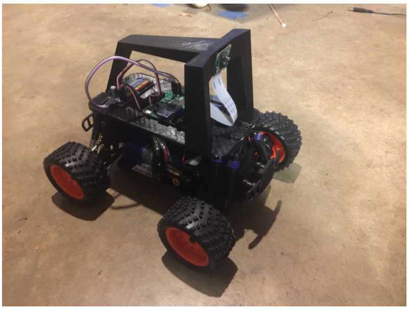

# donkeycar: a python self driving library

[](https://travis-ci.org/wroscoe/donkey)
[](https://codecov.io/gh/wroscoe/donkey/branch/dev)
[](https://badge.fury.io/py/donkeycar)
[](https://img.shields.io/pypi/pyversions/donkeycar.svg)

Donkeycar is minimalist and modular self driving library for Python. It is
developed for hobbyists and students with a focus on allowing fast experimentation and easy
community contributions.

#### Quick Links
* [Donkeycar Updates & Examples](http://donkeycar.com)
* [Build instructions and Software documentation](http://docs.donkeycar.com)
* [Slack / Chat](https://donkey-slackin.herokuapp.com/)



#### Use Donkey if you want to:
* Make an RC car drive its self.
* Compete in self driving races like [DIY Robocars](http://diyrobocars.com)
* Experiment with autopilots, mapping computer vision and neural networks.
* Log sensor data. (images, user inputs, sensor readings)
* Drive your car via a web or game controller.
* Leverage community contributed driving data.
* Use existing CAD models for design upgrades.

### Get driving.
After building a Donkey2 you can turn on your car and go to http://localhost:8887 to drive.

### Modify your cars behavior.
The donkey car is controlled by running a sequence of events

```python
#Define a vehicle to take and record pictures 10 times per second.

from donkeycar import Vehicle
from donkeycar.parts.camera import PiCamera
from donkeycar.parts.datastore import Tub


V = Vehicle()

#add a camera part
cam = PiCamera()
V.add(cam, outputs=['image'], threaded=True)

#add tub part to record images
tub = Tub(path='~/mycar/get_started',
          inputs=['image'],
          types=['image_array'])
V.add(tub, inputs=['image'])

#start the drive loop at 10 Hz
V.start(rate_hz=10)
```

See [home page](http://donkeycar.com), [docs](http://docs.donkeycar.com)
or join the [Slack channel](http://www.donkeycar.com/community.html) to learn more.
