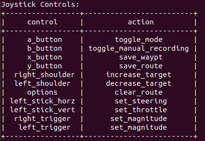
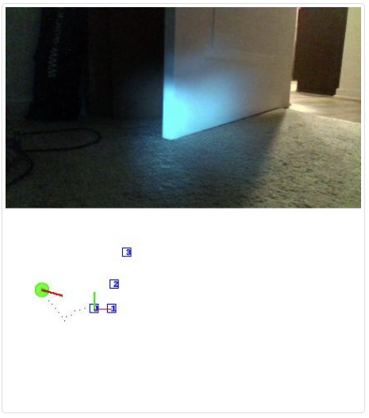

# Waypoint navigation mode

* This uses the DonkeyCar python library: [Donkeycar Updates & Examples](http://donkeycar.com)
* use this: `python navigation.py drive` to run donkeyCar with way-point navigation.
* requires Realsense T265 tracking camera to provide localization information.
* you can save current position as a way point (`x_button` on xbox controller).
* you can save way points to a route file (`y_button` on xbox controller).
* you can change waypoint target (`right_shoulder` to target the next waypoint, `left_shoulder` to target the previous one, on xbox controller)
    * read the start menu to know the controls:

    

* the web control UI will display way points route, the tracked path and the pose of the car, like this:

    

## Placeholder for a tutorial

---------------------------------------
