# How to Build a Donkey V2

&nbsp;

* [Overview](build_hardware.md#overview)
* [Parts Needed](build_hardware.md#parts-needed)
* [Hardware:](build_hardware.md#hardware)
    * [Step 1: Print Parts](build_hardware.md#step-1-print-parts)
    * [Step 2: Clean up parts](build_hardware.md#step-2-clean-up-parts)
    * [Step 3: Assemble Top plate and Roll Cage](build_hardware.md#step-3-assemble-top-plate-and-roll-cage)
    * [Step 4: Connect Servo Shield to Raspberry Pi](build_hardware.md#step-4-connect-servo-shield-to-raspberry-pi)
    * [Step 5: Attach Raspberry Pi to 3D Printed bottom plate](build_hardware.md#step-5-attach-raspberry-pi-to-3d-printed-bottom-plate)
    * [Step 6: Attach Camera](build_hardware.md#step-6-attach-camera)
    * [Step 7: Put it all together](build_hardware.md#step-7-put-it-all-together)
 * [Software](install_software.md)

&nbsp;

## Overview

These are updated instructions from the 2017 article  [Make Magazine article](https://makezine.com/projects/build-autonomous-rc-car-raspberry-pi/).  The latest version of the software installation instructions are maintained in the [software instructions](install_software.md) section.   Be sure to follow those instructions after you've built your car.

## Choosing a Car
There are 4 fully supported chassis all made under the "Exceed" Brand:

*  Exceed Magnet [Blue](https://www.amazon.com/gp/product/9269803775/?tag=donkeycar-20), [Red](http://amzn.to/2EIC1CF)
*  Exceed Desert Monster [Blue](http://amzn.to/2HLXJmc),  [Red](http://amzn.to/2pnIitV)
*  Exceed Short Course Truck  [Blue](https://amzn.to/2KsYF1e),  [Red](https://amzn.to/2rdtQ8z)
*  Exceed Blaze [Hyper Blue](https://amzn.to/2rf4MgS), [Yellow](https://amzn.to/2jlf3EA)

These cars are electrically identical but have different tires, mounting and other details.  It is worth noting that the Desert Monster, Short Course Truck and Blaze all require adapters which can be easily printed or purchased from the donkey store.  These are the standard build cars because they are mostly plug and play, both have a brushed motor which makes training easier, they handle rough driving surfaces well and are inexpensive.
For more detail and other options, follow the link to: [supported cars](/supported_cars.md)

Here is a [video](https://youtu.be/UucnCmCAGTI) overview of the different cars and how to assemble them.

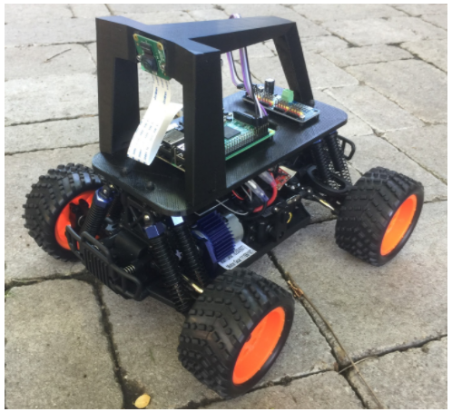

&nbsp;
## Roll Your Own Car
Alternatively If you know RC or need something the standard Donkey does not support, you can roll your own.  Here is a quick reference to help you along the way.  [Roll Your Own](/roll_your_own.md)

## Parts Needed:

### Option 1: Buying through an official Donkey Store
There are two official stores:

If you are in the US, you can use the Donkeystore.  The intention of the Donkey Store is to make it easier and less expensive to build the Donkey Car.  The Donkey Store is run by the original founders of donkey car and profits are used to fund development of the donkey cars.  Also it is worth noting the design of the parts out of the Donkey store is slightly improved over the standard build as it uses better parts that are only available in large quantities or are harder to get.  The Donkey Store builds are open source like all others.   

If you are in Asia, the DIYRobocars community in Hong Kong also sells car kits at [Robocar Store](https://www.robocarstore.com/products/donkey-car-starter-kit).  They are long term Donkey community members and use proceeds to support the R&D efforts of this project. It is worth noting they can also sell to Europe and the US but it is likely less cost effective.  

| Part Description                                                                    | Link                                                                                  | Approximate Cost |
|-------------------------------------------------------------------------------------|---------------------------------------------------------------------------------------|------------------|
| Exceed Magnet, Desert Monster, Blaze, or Short Course Truck                                                                       | See links above                                     | ~$90              |
| USB Battery with microUSB cable (any battery capable of 2A 5V output is sufficient) | [Anker 6700 mAh](http://amzn.to/2ptshm0)                                           | $17              |
| Raspberry Pi 3                                                                      | [amazon.com/gp/product/B01CD5VC92](https://www.amazon.com/gp/product/B01CD5VC92?tag=donkeycar-20)                                          | $38              |
| MicroSD Card (many will work, I like this one because it boots quickly)             | [amazon.com/gp/product/B01HU3Q6F2](https://www.amazon.com/gp/product/B01HU3Q6F2?tag=donkeycar-20)                                         | $18.99           |
| Donkey Partial Kit                                                      | [Magnet] ](https://squareup.com/store/donkeycar/item/magnet-partial-kit) or [Desert Monster, SCT, Blaze](https://squareup.com/store/donkeycar/item/desert-monster-short-course-truck-or-blaze-partial-kit)                                         | $85 or $92              |

### Option 2:Bottoms Up Build
If you want to buy the parts yourself, want to customize your donkey or live out to of the US, you may want to choose the bottoms up build.  

| Part Description                                                                    | Link                                                                                  | Approximate Cost |
|-------------------------------------------------------------------------------------|---------------------------------------------------------------------------------------|------------------|
| Magnet Car or alternative                                                                        | [Blue](https://www.amazon.com/gp/product/9269803775/?tag=donkeycar-20), [Red](http://amzn.to/2EIC1CF)                                         | $92              |
| M2x6 screws (4)                                                                     | [mcmaster.com/#91292a831/=177k4rp](https://www.mcmaster.com/#91292a831/=177k4rp)                                          | $6.38 &ast;          |
| M2.5x12 screws (8)                                                                  | [mcmaster.com/#91292a016/=177k574](https://www.mcmaster.com/#91292a016/=177k574)                                          | $4.80 &ast;          |
| M2.5 nuts (8)                                                                       | [mcmaster.com/#91828a113/=177k7ex](https://www.mcmaster.com/#91828a113/=177k7ex)                                          | $5.64 &ast;          |
| M2.5 washers (8)                                                                    | [mcmaster.com/#93475a196/=177k7x6](https://www.mcmaster.com/#93475a196/=177k7x6)                                          | $1.58 &ast;          |
| USB Battery with microUSB cable (any battery capable of 2A 5V output is sufficient) | [Anker 6700 mAh](http://amzn.to/2ptshm0)                                           | $17              |
| Raspberry Pi 3                                                                      | [amazon.com/gp/product/B01CD5VC92](https://www.amazon.com/gp/product/B01CD5VC92?tag=donkeycar-20)                                          | $38              |
| MicroSD Card (many will work, I like this one because it boots quickly)             | [amazon.com/gp/product/B01HU3Q6F2](https://www.amazon.com/gp/product/B01HU3Q6F2?tag=donkeycar-20)                                         | $18.99           |
| Wide Angle Raspberry Pi Camera                                                      | [amazon.com/gp/product/B00N1YJKFS](https://www.amazon.com/gp/product/B00N1YJKFS?tag=donkeycar-20)                                         | $25              |
| Female to Female Jumper Wire                                                        | [amazon.com/gp/product/B010L30SE8](https://www.amazon.com/gp/product/B010L30SE8?tag=donkeycar-20)                                          | $7 &ast;             |
| Servo Driver PCA 9685                                                               | [amazon.com/gp/product/B014KTSMLA](https://www.amazon.com/gp/product/B014KTSMLA?tag=donkeycar-20)                                          | $12 &ast;&ast;           |
| 3D Printed roll cage and top plate.                                                 | Purchase: [Donkey Store](https://squareup.com/store/donkeycar) Files: [thingiverse.com/thing:2260575](http://www.thingiverse.com/thing:2260575) | $45                 |

&ast; These components come in minimum quantities much higher than is necessary for a vehicle.  If you get with friends to build several the total cost of the car will be $20 cheaper.  

&ast;&ast; This component can be purchased from Ali Express for ~2 if you can wait the 15-45 days for shipping.

&nbsp;

### Optional Upgrades
* **LiPo Battery and Accessories:** LiPo batteries have significantly better energy density and have a better dropoff curve.  See below (courtesy of Traxxas).

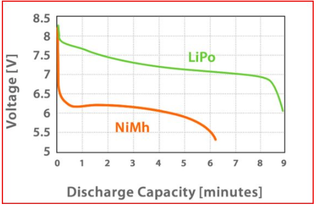

| Part Description                                      | Link                                                              | Approximate Cost |
|-------------------------------------------------------|-------------------------------------------------------------------|------------------|
| LiPo Battery                                          | [hobbyking.com/en_us/turnigy-1800mah-2s-20c-lipo-pack.html](https://hobbyking.com/en_us/turnigy-1800mah-2s-20c-lipo-pack.html) or [amazon.com/gp/product/B0072AERBE/](https://www.amazon.com/gp/product/B0072AERBE/) | $8.94 to $~17           |
| Lipo Charger (takes 1hr to charge the above battery)  | [amazon.com/gp/product/B00XU4ZR06](https://www.amazon.com/gp/product/B00XU4ZR06?tag=donkeycar-20)                                               | $13              |
| Lipo Battery Case (to prevent damage if they explode) | [amazon.com/gp/product/B00T01LLP8](https://www.amazon.com/gp/product/B00T01LLP8?tag=donkeycar-20)                                               | $8               |

&nbsp;

## Hardware
If you purchased parts from the Donkey Car Store, skip to step 3.
### Step 1: Print Parts

If you do not have a 3D Printer, you can order parts from [Donkey Store](https://squareup.com/store/donkeycar), [Shapeways](https://www.shapeways.com/) or [3dHubs](https://www.3dhubs.com/).  I printed parts in black PLA, with 2mm layer height and no supports.  The top roll bar is designed to be printed upside down.   Remember that you need to print the adapters unless you have a "Magnet"

I printed parts in black PLA, with .3mm layer height with a .5mm nozzle and no supports.  The top roll bar is designed to be printed upside down.  

&nbsp;
### Step 2: Clean up parts
Almost all 3D Printed parts will need clean up.  Re-drill holes, and clean up excess plastic.

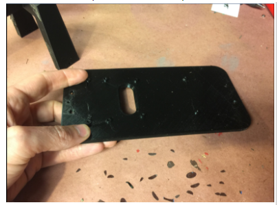

In particular, clean up the slots in the side of the roll bar, as shown in the picture below:

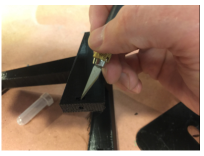

&nbsp;
### Step 3: Assemble Top plate and Roll Cage
If you have an Exceed Short Course Truck, Blaze or Desert Monster watch this [video](https://youtu.be/UucnCmCAGTI)

Slide the nut into the slot in the side of the roll cage.  This is not particularly easy.  You may need to clean out the hole again and use a small screwdriver to push the screw in such that it lines up with the hole in the bottom of the roll cage.

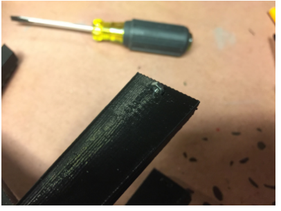

Once you have slid the nut in, you can attach the bottom plate.  Once again, this may be tricky.  I use the small screwdriver to push against the nut to keep it from spinning in the slot.  Good news: you should never have to do this again.

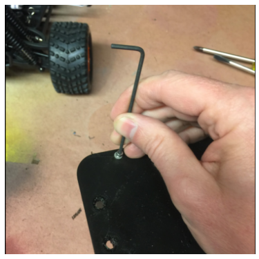

&nbsp;
### Step 4: Connect Servo Shield to Raspberry Pi.
You could do this after attaching the Raspberry Pi to the bottom plate, I just think it is easier to see the parts when they are laying on the workbench.  Connect the parts as you see below:

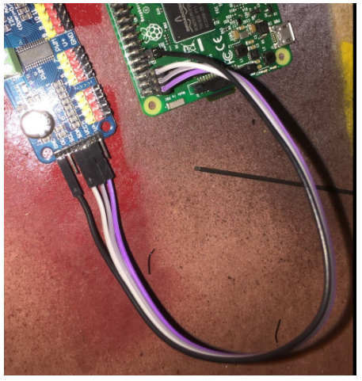

For reference, below is the Raspberry Pi Pinout for reference.  You will notice we connect to 3.3v, the two I2C pins (SDA and SCL) and ground:

&nbsp;
### Step 5: Attach Raspberry Pi to 3D Printed bottom plate.  
Before you start, now is a good time to insert the already flashed SD card and bench test the electronics.  Once that is done, attaching the Raspberry Pi and Servo is as simple as running screws through the board into the screw bosses on the top plate.  The M2.5x12mm screws should be the perfect length to go through the board, the plastic and still have room for a washer.  The “cap” part of the screw should be facing up and the nut should be on the bottom of the top plate.  The ethernet and USB ports should face forward.  This is important as it gives you access to the SD card and makes the camera ribbon cable line up properly.

Attach the USB battery to the underside of the printed bottom plate using cable ties or velcro.

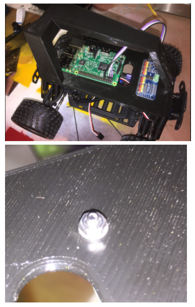

&nbsp;
### Step 6: Attach Camera
There are two versions of the donkey chassis, the newer one does not have screws, the older one does. This includes instructions for both:

**Screwless Design**
The newer design is pretty simple, just slip the camera into the slot, cable end first.  However, be careful not to push on the camera lens and instead press the board.
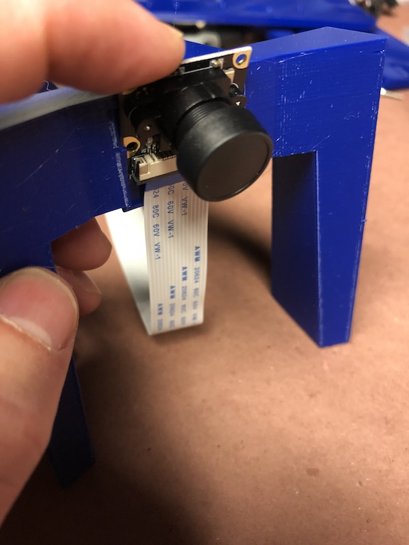

If you need to remove the camera the temptation is to push on the lens, instead push on the connector as is shown in these pictures.  
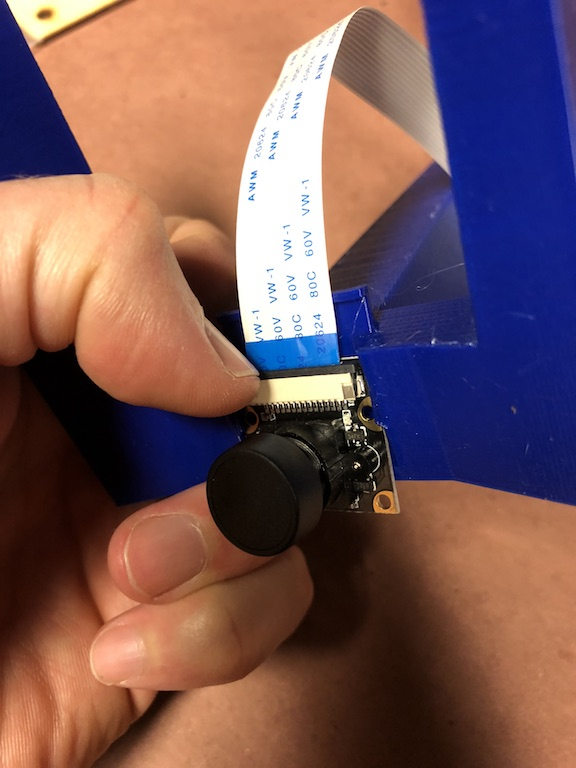 

**Design with Screws**

Attaching the camera is a little tricky, the M2 screws can be screwed into the plastic but it is a little hard.  I recommend drilling the holes out with a 1.5mm bit (1/16th bit in Imperial land) then pre threading them with the screws before putting the camera on. It is only necessary to put two screws in.

>Sometimes using the two top screw holes can result in a short. Put screws in the bottom two holes.

Before using the car, remove the plastic film from the camera lens.

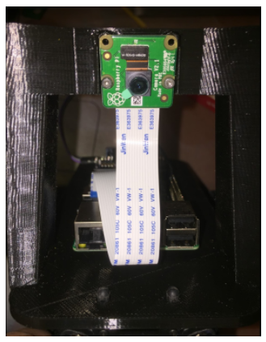

It is easy to put the camera cable in the wrong way so look at these photos and make sure the cable is put in properly.  There are loads of tutorials on youtube if you are not used to this.

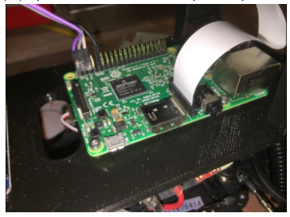

&nbsp;
### Step 7: Put it all together
*** Note if you have a Desert Monster Chassis see 7B section below ***
The final steps are straightforward.  First attach the roll bar assembly to the car.  This is done using the same pins that came with the vehicle.  

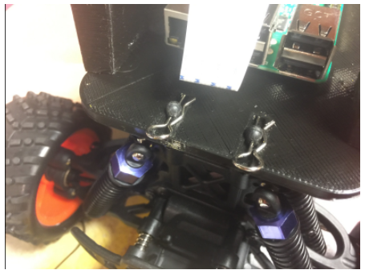

Second run the servo cables up to the car.  The throttle cable runs to channel 0 on the servo controller and steering is channel 1.

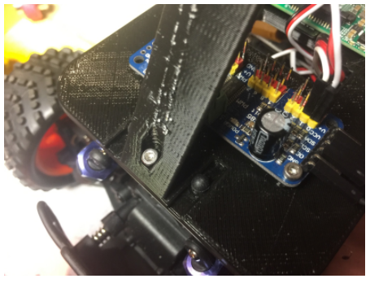

Now you are done with the hardware!!

### Step 7b: Attach Adapters (Desert Monster only)

The Desert monster does not have the same set up for holding the body on the car and needs two adapters mentioned above.  To attach the adapters you must first remove the existing adapter from the chassis and screw on the custom adapter with the same screws as is shown in this photo:

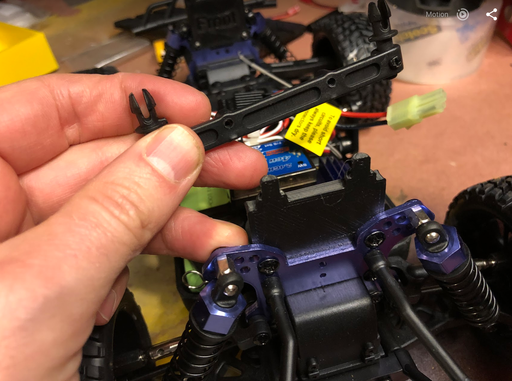

Once this is done, go back to step 7

&nbsp;
## Software
Congrats!  Now to get your get your car moving, see the [software instructions](install_software.md) section.

> We are a participant in the Amazon Services LLC Associates Program, an affiliate advertising program designed to provide a means for us to earn fees by linking to Amazon.com and affiliated sites.
