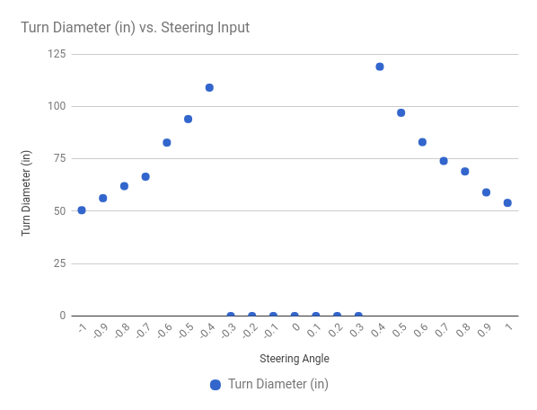

# Calibrate your Car

The point of calibrating your car is to make it drive consitently with
other vehicles. These instructions

## How to adjust your car's settings.

All of the car's settings are in the `config.py` script generated when
you ran the `donkey createcar --path ~/mycar` command. You can edit
this file on your car by running:
```bash
nano ~/mycar/config.py
```

Our goal is to edit these settings so your car will drive like every
other calibrated Donkey2. This way you'll be able to share pilots and
datasets between each car.


>You will need to ssh into your Pi to do the calibration.


## Steering Calibration

> Make sure your car is off the ground to prevent a runaway situation.

1. Turn on your car.
2. Find the servo cable on your car and see what channel it's plugged into the
PCA board. It should be 1 or 0.
3. Run `donkey calibrate --channel <your_steering_channel>`
4. Enter `360' and you should see the wheels on your car move slightly. If not
enter `400` or `300`.
5. Next enter values +/- 10 from your starting value to find the PWM setting
that makes your car turn all the way left and all the way right. Remember
these values.
6. Enter these values in `config.py` script as `STEERING_RIGHT_PWM` and
`STEERING_LEFT_PWM`.


## Throttle Calibration

1. Find the cable coming from your ESC and see what channel it goes into the
PCA board. This is your throttle channel.
2. run `donkey calibrate --channel <your_throttle_channel>`
3. Enter `370` when prompted for a PWM value.
4. You should hear your ESC beep indicating that it's calibrated.
5. Enter `400` and you should see your cars wheels start to go forward. If not,
its likely that this is reverse, try entering `330` instead.
6. Keep trying different values until you've found a reasonable max speed and
remember this PWM value.


Reverse on RC cars is a little tricky because the ESC must receive a
reverse pulse, zero pulse, reverse pulse to start to go backwards. To calibrate
a reverse PWM setting...

1. Use the same technique as above set the PWM setting to your zero throttle.
2. Enter the reverse value, then the zero throttle value, then the reverse
value again.
3. Enter values +/- 10 of the reverse value to find a reasonable reverse speed.
Remember this reverse PWM value.


Now open your `config.py` script and enter the PWM values for your car into
the throttle_controller part.
* `THROTTLE_FORWARD_PWM` = PWM value for full throttle forward
* `THROTTLE_STOPPED_PWM` = PWM value for zero throttle
* `THROTTLE_REVERSE_PWM` = PWM value at full reverse throttle


## Fine tuning your calibration.


Now that you have your car roughly calibrated you can try driving it to
verify that it drives as expected. Here's how to fine tune your car's calibration.

1. Start your car by running `python manage.py drive`.
2. Go to `<your_cars_ip_address>:8887` in a browser.
3. Press `j` until the cars steering is all the way right.
4. Press `i` a couple times to get the car to go forward.
5. Measure the diameter of the turn and record it on a spreadsheet.
6. Repeat this measurement for different steering values for turning each
direction.
7. Chart these so you can see if your car turns the same in each direction.

Corrections
* If your car turns the same amount at an 80% turn and a 100% turn, change the
PWM setting for that turn direction to be the PWM value at 80%.
* If your car is biased to turn one direction, change the PWM values of your turns
in the opposite direction of the bias.

After you've fine tuned your car the steering chart should look something like
this.


