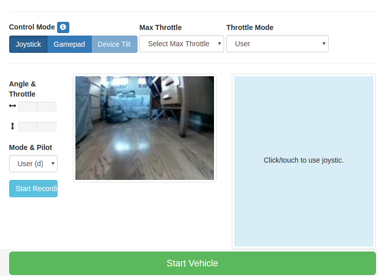

# Drive your car.

After you've calibrated your car you can start driving it.

### Start your car.

> *** Put your car in a safe place where the wheels are off the ground ***
This is the step were the car can take off.

---
# Normal usage
In future runs, when you start a new session, you will want to:

On Windows:

* start a new Anaconda Prompt from Windows start menu
* Activate mappings to donkey Python setup with: ```activate donkey```
* Change to your local dir for managing donkey: ```cd ~/mycar```
* Find your pi


This will show your IP address, prompt for your password, and then search
for your cars IP address.

> If your car's IP address is not shown:
>
> 1. Find another way to scan your local network for your raspberry pi
> 2. Connect a monitor/keyboard and ensure your pi is connected to the the same wifi network as your computer.


Assuming that you did find your pi on the network, you can now connect to it via SSH.

```
ssh pi@<your_pi_ip_address>
```

The default user name is 'pi' and the password is 'raspberry'.  If you are using the pre-built Donkey image, the password is 'asdfasdf'.


### Make sure you've created your car application.
```
donkey createcar --template donkey2 --path ~/mycar
```

See also [more information.](/utility/donkey/#create-car)

#### Start your car.
Open your car's folder and start your car.
```
cd ~/mycar
python manage.py drive
```

This script will start the drive loop in your car which includes a part that
is a web server for you to control your car. You can now control your car
from a web browser at the URL: `<your car's IP's address>:8887`



## Driving with Web Controller
On your phone you can now press start to set your phones current tilt to be
zero throttle and steering. Now tilting your phone forward will increase throttle and tilting it side to side will turn the steering.


### Features
* Recording - Press record data to start recording images, steering angels and throttle values.
* Throttle mode - Option to set the throttle as constant. This is used in
races if you have a pilot that will steer but doesn't control throttle.
* Pilot mode - Choose this if the pilot should control the angle and/or throttle.
* Max throttle - Select the maximum throttle.

### Keyboard shortcuts
* `space` : stop car and stop recording
* `r` : toggle recording
* `i` : increase throttle
* `k` : decrease throttle
* `j` : turn left
* `l` : turn right

----

## Driving with Physical Joystick Controller

You may find that it helps to use a physical joystick device to control your vehicle.

### Setup Bluetooth and pair joystick
Check the [Controllers](/parts/controllers/#physical-joystick-controller) section to read about setting up the bluetooth connection.

### Start car
```
cd ~/mycar
python manage.py drive --js
```

Optionally, if you want joystick use to be sticky and don't want to add the --js each time, modify your config.py so that USE_JOYSTICK_AS_DEFAULT = True
```
nano config.py
```


### Joystick Controls

* Left analog stick - Left and right to adjust steering
* Right analog stick - Forward to increase forward throttle
* Pull back twice on right analog to reverse

> Whenever the throttle is not zero, driving data will be recorded - as long as you are in User mode!

* Select button switches modes - "User, Local Angle, Local(angle and throttle)"
* Triangle - Increase max throttle
* X  - Decrease max throttle
* Circle - Toggle recording (disabled by default. auto record on throttle is enabled by default)
* dpad up - Increase throttle scale
* dpad down - Decrease throttle scale
* dpad left - Increase steering scale
* dpad right - Decrease steering scale
* Start - Toggle constant throttle. Sets to max throttle (modified by X and Triangle).


### Start car for self-driving
```
cd ~/mycar
python manage.py drive --model <path/to/model> --js
```

Hit the Select button to toggle between three modes - User, Local Angle, and Local Throttle & Angle.

* User - User controls both steering and throttle with joystick
* Local Angle - Ai controls steering, user controls throttle
* Local Throttle & Angle - Ai controls both steering and throttle

When the car is in Local Angle mode, the NN will steer. You must provide throttle.


