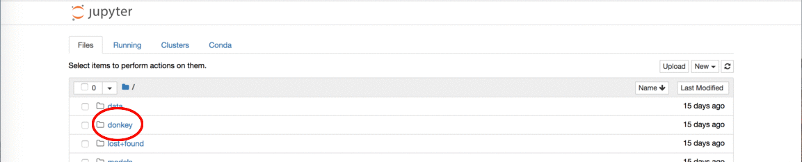

# Install Software

This guide will help you to setup the software to run Donkey on your Raspberry Pi, as well as the host PC operating system of your choice.

* Setup [RaspberryPi](#get-the-raspberry-pi-working)
* Setup [Linux Host PC](#install-donkeycar-on-linux)
* Setup [Windows Host PC](#install-donkeycar-on-windows)
* Setup [Mac Host PC](#install-donkeycar-on-mac)
* Setup [AWS SageMaker](#install-donkeycar-on-aws-sagemaker)

----
### Get the Raspberry Pi working.

Before we can do anything we have to get our car's computer connected to the
internet. The fastest way is to use the disk image created for donkey cars.

The method for using a disk image to create a bootable SD card varies between
operating systems. These instructions are for Ubuntu but you can see more
instructions [here](https://www.raspberrypi.org/documentation/installation/installing-images/).

1. Download prebuilt zipped disk image for [RPi 3B and 3B+](https://drive.google.com/open?id=1vr4nEXLEh4xByKAXik8KhK3o-XWgo2fQ) for [RPi Zero](https://drive.google.com/open?id=1otqNRBs1kqNJYocCp4kbMjcRKWE2zW7A) (1.1GB).
2. Unzip the disk image.
3. Plug your SD card into your computer.
4. Open the "Startup Disk Creator" application.
5. Select your source disk image as the one you unzipped earlier.
6. Select your SD card as the disk to use.
7. Click "Make startup disk".


### Setup the Pi's WiFi for first boot

We can create a special file which will be used to login to wifi on first boot. More reading [here](https://raspberrypi.stackexchange.com/questions/10251/prepare-sd-card-for-wifi-on-headless-pi), but we will walk you through it.

On Windows, with your memory card image burned and memory disc still inserted, you should see two drives, which are actually two partitions on the mem disc. One is labeled __boot__. On Mac and Linux, you should also have access to the __boot__ partition of the mem disc. This is formated with the common FAT type and is where we will edit some files to help it find and log-on to your wifi on it's first boot.

* Start a text editor: `gedit` on Linux. Notepad on Windows. TextEdit on a Mac.
* Paste and edit this contents to match your wifi:
```
country=US
ctrl_interface=DIR=/var/run/wpa_supplicant GROUP=netdev
update_config=1

network={
    ssid="<your network name>"
    psk="<your password>"
}

```

Replace `<your network name>` with the ID of your network. Leave the quotes. I've seen problems when the network name contained an apostrophe, like "Joe's iPhone".
Replace `<your password>` with your password, leaving it surrounded by quotes.
If it bothers you to leave your password unencrypted, you may change the [contents later](https://unix.stackexchange.com/questions/278946/hiding-passwords-in-wpa-supplicant-conf-with-wpa-eap-and-mschap-v2) once you've gotten the pi to boot and log-in.

* Save this file to the root of __boot__ partition with the filename `wpa_supplicant.conf`. On first boot, this file will be moved to `/etc/wpa_supplicant/wpa_supplicant.conf` where it may be edited later.

##### Setup Pi's Hostname
We can also setup the hostname so that your Pi easier to find once on the network. If yours is the only Pi on the network, then you can find it with

```
ping donkeypi.local
```

once it's booted. If there are many other Pi's on the network, then this will have problems. If you are on a Linux machine, or are able to edit the UUID partition, then you can edit the `/etc/hostname` and `/etc/hosts` files now to make finding your pi on the network easier after boot. Edit those to replace `raspberrypi` with a name of your choosing. Use all lower case, no special characters, no hyphens, no underscores `_`.

```
sudo vi /media/userID/UUID/etc/hostname
sudo vi /media/userID/UUID/etc/hosts
```

Now you're SD card is ready. Eject it from your computer, put it in the Pi
and plug in the Pi.


### Connecting to the Pi

If you followed the above instructions to add wifi access your Pi should
now be connected to your wifi network. Now you need to find its IP address
so you can connect to it via SSH.

The easiest way (on Ubuntu) is to use the `findcar` donkey command. You can try `ping donkeypi.local`. If you've modified the hostname, then you should try: `ping <your hostname>.local`. This will fail on a windows machine. Windows users will need the full IP address (unless using cygwin).

If you are having troubles locating your Pi on the network, you will want to plug in an HDMI monitor and USB keyboard into the Pi. Boot it. Login with:

* Username: __pi__
* Password: __raspberry__

Then try the command:

```
ifconfig wlan0
```

If this has a valid IPv4 address, 4 groups of numbers separated by dots, then you can try that with your SSH command. If you don't see anything like that, then your wifi config might have a mistake. You can try to fix with

```
sudo nano /etc/wpa_supplicant/wpa_supplicant.conf
```

If you don't have a HDMI monitor and keyboard, you can plug-in the Pi with a CAT5 cable to a router with DHCP. If that router is on the same network as your PC, you can try:

```
ping donkeypi.local
```

Hopefully, one of those methods worked and you are now ready to SSH into your Pi. On Mac and Linux, you can open Terminal. On Windows you can install [Putty](http://www.putty.org/) or [one of the alternatives](https://www.htpcbeginner.com/best-ssh-clients-windows-putty-alternatives/2/).

If you have a command prompt, you can try:

```
ssh pi@donkeypi.local
```

or

```
ssh pi@<your pi ip address>
```

or via Putty:
* Username: __pi__
* Password: __raspberry__
* Hostname:`<your pi IP address>`


If you are using the prebuilt image specified above, then your Pi is ready to go. You should see a mycar and donkey directory.

> Note: Check config.py to make sure it uses the correct settings for the PWM channel for steering and throttle. Open config.py ```nano ~/mycar/config.py``` and make sure that you see the lines:
>
> * STEERING_CHANNEL = 1
> * THROTTLE_CHANNEL = 0
>
> The 1 and 0 for the parts arguments should match whichever channel you used to plug your servo/ESC leads in to your 9685 board. Usually this ranges from 0-15 and it numbered on the board.

> Note: If you are using the prebuilt image specified above, your Pi is not using the full capacity of the SD card. To make the full capacity accessible, SSH into the Pi and run `sudo raspi-config` to go into the configuration tool. Select `7 Advanced Options` and `A1 Expand Filesystem`. And then select `<Finish>` to exit the configuration tool and reboot. The Pi can access the full capacity of the SD card now.

### Install Donkeycar

The disk image only has the libraries(tensorflow..) installed, not donkeycar.

```bash
pip install donkeycar[pi]
#test that you are using the most recent version (found in __init__ file)
python -c "import donkeycar as dk; print(dk.__version__)"
```


### Create your car app.

Now generate the drive script, config and folder structure for your car.

```bash
donkey createcar ~/mycar
```

----
Now let's setup the same donkey library on your laptop or server so you can test and train autopilots. Install varies depending on platform.

## Install donkeycar on Linux

Install dependencies, setup virtualenv
```bash
sudo apt-get install virtualenv build-essential python3-dev gfortran libhdf5-dev
virtualenv env -p python3
source env/bin/activate
pip install tensorflow==1.8.0
```

* Install donkey source and create your local working dir:
```bash
git clone https://github.com/wroscoe/donkey donkeycar
pip install -e .
```

[Next: Calibrate your car.](./calibrate.md)

----

## Install donkeycar on Windows

* Install [miniconda Python 3.6 64 bit](https://conda.io/miniconda.html). Be sure to check the box to allow it to modify your system path variable to add conda.

* Install [git 64 bit](https://git-scm.com/download/win)

* From the start menu start the Anaconda Prompt.

* Change to a dir you would like to use as the head of your projects.

```
mkdir projects
cd projects
```

* Get the latest donkey from Github.

```
git clone https://github.com/wroscoe/donkey
cd donkey
```

* Create the Python Anaconda environment

```
conda env create -f envs\windows.yml
activate donkey
```

* Install donkey source and create your local working dir:

```
pip install -e .
donkey createcar ~/mycar
```


> Note: After closing the Anaconda Prompt, when you open it again, you will need to
> type ```activate donkey``` to re-enable the mappings to donkey specific
> Python libraries

[Next: Calibrate your car.](./calibrate.md)

----

## Install donkeycar on Mac

* Install [miniconda Python 3.6 64 bit](https://conda.io/miniconda.html)

* Install [git 64 bit](https://www.atlassian.com/git/tutorials/install-git)

* Start Terminal

* If Xcode or gcc not installed - run the following command to install Command Line Tools for Xcode.

```
xcode-select --install
```

* Change to a dir you would like to use as the head of your projects.

```
mkdir projects
cd projects
```

* Get the latest donkey from Github.

```
git clone https://github.com/wroscoe/donkey
cd donkey
```

* Create the Python anaconda environment

```
conda env create -f install/envs/mac.yml
source activate donkey
```

* Install Tensorflow

```
pip install https://storage.googleapis.com/tensorflow/mac/cpu/tensorflow-1.3.0-py3-none-any.whl
```


* Install donkey source and create your local working dir:

```
pip install -e .
donkey createcar ~/mycar
```

[Next: Calibrate your car.](./calibrate.md)

> Note: After closing the Terminal, when you open it again, you will need to
> type ```source activate donkey``` to re-enable the mappings to donkey specific
> Python libraries

----

## Install donkeycar on AWS Sagemaker

### Introduction

The following instructions will show you how to install donkeycar on an [AWS SageMaker](https://aws.amazon.com/sagemaker/) *Notebook instance*.

The *Notebook instance* is typically used for experimenting and preparing your data and model for training. The convention is then to distribute the training on a separate cluster of *training instances*. This, however, requires you to adapt your training script (and model) to work in a distributed manner, preferably using the [SageMaker Python SDK](https://github.com/aws/sagemaker-python-sdk), which is not currently available in Donkey.

That said, it is still possible to install and train your model on the *Notebook instance*. It will allow you to train your [Keras model](../../donkeycar/parts/keras.py) using a beefy instance type with a large GPU, and, perhaps most importantly, shut it down when finished so that you only pay for what you use.

### Create a Notebook instance

If you havn't already, log in to your [AWS Console](https://console.aws.amazon.com/console/home) and create a new [AWS SageMaker](https://aws.amazon.com/sagemaker/) Notebook instance:

- https://docs.aws.amazon.com/sagemaker/latest/dg/how-it-works-notebooks-instances.html#howitworks-create-ws

Suggest using a `ml.p2.xlarge` instance type. You can find a list of available types here:

- https://aws.amazon.com/sagemaker/pricing/instance-types/

### Clone the donkey git in SageMaker

When you've created your new instance, open it up and create a new [Jupyter Notebook](http://jupyter.org/) (click *New*, *conda_tensorflow_p36*).

* In the first cell, type:
```python
!git clone https://github.com/wroscoe/donkey ~/SageMaker/donkey
```

* Close the Jupyter Notebook (not the instance!). You can delete it if you want.

### Install donkey on SageMaker

After cloning the git, you'll find the donkey folder in the SageMaker Notebook root:



* Open *donkey/docs/guide/sm-install-donkey.ipynb* and follow the instructions.

-------

### Install another fork of donkeycar

Occasionally you may want to run with changes from a separate fork of donkey. You may uninstall one and install another. That's fastest, but leaves you with only the forked version installed:

```
pip uninstall donkeycar
git clone --depth=1 https://github.com/<username>/donkey donkey_<username>
cd donkey_<username>
pip install -e .
```

To get back to the stock donkey install:

```
pip uninstall donkeycar
pip install donkeycar
```

### Install donkeycar with TensorFlow dependencies

Donkey requires the TensorFlow library to work. It comes in 2 flavors; *tensorflow* (CPU) and *tensorflow-gpu* (GPU).

This poses a problem, because if donkey specifies either of them as a dependency, `pip` will uninstall any pre-installed version of the **other** flavor of the library. And since they are mutually exclusive, both cannot be listed as dependencies.

To solve this, donkey does not specify *tensorflow* nor *tensorflow-gpu* as dependencies. Instead, they are listed as `extras_require`, which means you have to explicitly tell `pip` what flavor you want to use. If no flavor is specified (default), it is assumed one version of *TensorFlow* is already installed.

Install donkeycar assuming a compatible tensorflow library (either *tensorflow* or *tensorflow-gpu*) already installed:
```bash
# Assuming CWD is the cloned donkey git
pip install donkeycar
```

Install donkeycar and use *tensorflow* dependency:
```bash
pip install donkeycar[tf]
```

Install donkeycar and use *tensorflow-gpu* dependency:
```bash
pip install donkeycar[tf_gpu]
```

See [https://github.com/tensorflow/tensorflow/issues/7166](https://github.com/tensorflow/tensorflow/issues/7166) for more information.
