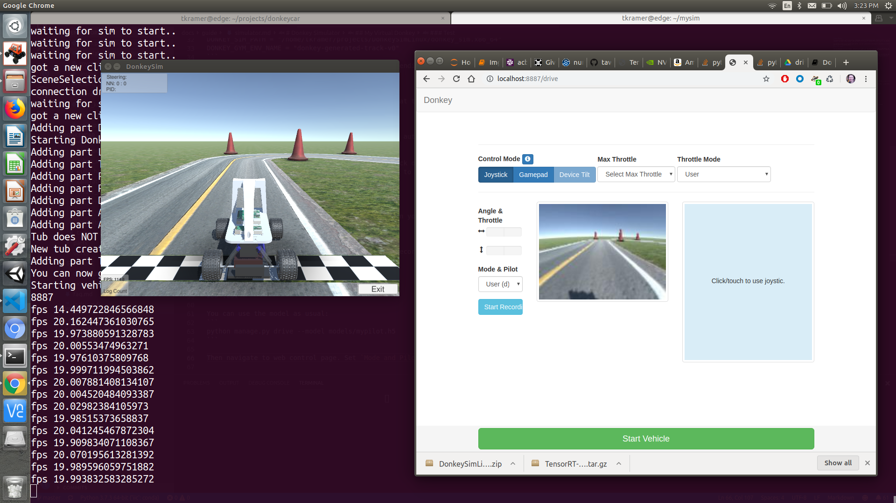

# Donkey Simulator

The [Donkey Gym](https://github.com/tawnkramer/gym-donkeycar) project is a OpenAI gym wrapper around the [Self Driving Sandbox](https://github.com/tawnkramer/sdsandbox/tree/donkey) donkey simulator (`sdsandbox`). When building the sim from source, checkout the `donkey` branch of the `sdsandbox` project. 

The simulator is built on the the [Unity](https://unity.com/) game platform, uses their internal physics and graphics, and connects to a donkey Python process to use our trained model to control the simulated Donkey.

## Installation Video:

Here's some videos to help you through the installation.

Linux:
https://youtu.be/J6Ll5Obtuxk

Windows:
https://youtu.be/wqQMmHVT8qw

## My Virtual Donkey

There are many ways to use the simulator, depending on your goals. You can use the simulator to get to know and use the standard Donkeycar drive/train/test cycle by treating it as virtual hardware. You will collect data, drive, and train using the __same commands__ as if you were using a real robot. We will walk through that use-case first.



## Install

* Download and unzip the simulator for your host pc platform from [Donkey Gym Release](https://github.com/tawnkramer/gym-donkeycar/releases).
* Place the simulator where you like. For this example it will be ~/projects/DonkeySimLinux. Your dir will have a different name depending on platform. 
* Complete all the steps to [install Donkey on your host pc](install_software.md#step-1-install-software-on-host-pc).
* Setup DonkeyGym:

```bash
cd ~/projects
git clone https://github.com/tawnkramer/gym-donkeycar
conda activate donkey
pip install -e .[gym-donkeycar]
```

* You may use an existing ~/mycar donkey application, or begin a new one. Here we will start fresh: 

```bash
donkey createcar --path ~/mysim
cd ~/mysim
```

* Edit your myconfig.py to enable donkey gym simulator wrapper, replace `<user-name>` and the other parts of the path:

```bash
DONKEY_GYM = True
DONKEY_SIM_PATH = "/home/<user-name>/projects/DonkeySimLinux/donkey_sim.x86_64"
DONKEY_GYM_ENV_NAME = "donkey-generated-track-v0"
```


> Note: your path to the executable will vary depending on platform and user.
>  Windows: DonkeySimWin/donkey_sim.exe
>  Mac OS: DonkeySimMac/donkey_sim.app/Contents/MacOS/sdsim
>  Linux: DonkeySimLinux/donkey_sim.x86_64


## Drive

You may use all the normal commands to manage.py at this point. Such as:

```bash
python manage.py drive
```

This should start the simulator and connect to it automatically. By default you will have a web interface to control the donkey. Navigate to [http://localhost:8887/drive](http://localhost:8887/drive) to see control page.

On Ubuntu Linux only, you may plug in your joystick of choice.
If it mounts as `/dev/input/js0` then there's a good chance it will work.
Modify myconfig.py to indicate your joystick model and use the `--js` arg to run.

```bash
python manage.py drive --js
```

As you drive, this will create a tub of records in your data dir as usual.

## Train

You will not need to rsync your data, as it was recorded and resides locally. You can train as usual:

```bash
python manage.py train --model models/mypilot.h5
```

## Test

You can use the model as usual:

```bash
python manage.py drive --model models/mypilot.h5
```

Then navigate to web control page. Set `Mode and Pilot` to `Local Pilot(d)`. The car should start driving.

## Sample Driving Data

Here's some sample driving data to get you started. [Download this](https://drive.google.com/open?id=1A5sTSddFsf494UDtnvYQBaEPYX87_LMp) and unpack it into your data dir. This should train to a slow but stable driver.

---

## API

Here's some info on the api to talk to the sim server. Make a TCP client and connect to port 9091 on whichever host the sim is running. The server sends and recieves UTF-8 encoded JSON packets. Each message must have a "msg_type" field. The sim will end all JSON packets with a newline character for termination. You don't have to end each packet with a newline when sending to the server. But if it gets too many messages too quickly it may have troubles. Check the player log file for JSON parse errors if you are having troubles.

---

### Get Protocol Version

Client=>Sim. Ask for the version of the protocol. Will help know when changes are made to these messages.

Fields: *None*

Example:
```bash
    {
    "msg_type" : "get_protocol_version" 
    }
```


---

### Protocol Version

Sim=>Client. Reply for the version of the protocol. Currently at version 2.

Fields: 

* *version* : string integer

Example:
```bash
    {
    "msg_type" : "protocol_version",
    "version" : "2",
    }
```

---

### Scene Selection Ready

Sim=>Client. When the Menu scene is finished loading this will be sent. After this point, the sim can honor the Scene Loading message.

Fields: *None*

Example:
```bash
    {
    "msg_type" : "scene_selection_ready" 
    }
```

---


### Get Scene Names

Client=>Sim. Ask names of the scnee you can load.

Fields: *None*

Example:
```bash
    {
    "msg_type" : "get_scene_names" 
    }
```


---


### Scene Names

Sim=>Client. Sim will reply with list of scene names.

Fields: 

* *scene_names* : array of scene names

Example:
```bash
    {
    "msg_type" : "scene_names" 
    "scene_names" : [ "generated_road", "warehouse", "sparkfun_avc". "generated_track" ]
    }
```


---


### Load Scene

Client=>Sim. Asks the sim to load one of 4 scenes from the Menu screen.

Fields: 

*scene_name* : **generated_road | warehouse | sparkfun_avc | generated_track** ( or whatever list the sim returns from get_scene_names)

Example:
```bash
    {
        "msg_type" : "load_scene",
        "scene_name" : "generated_track"
    }
```

---

### Scene Loaded

Sim=>Client. Once scene is loaded, in reply, you will get a:

```bash
    {
        "msg_type" : "scene_loaded"
    }
```


---

### Car Loaded

Sim=>Client. Once the sim finishes loading your car, it sends this message. The car is loaded for you automatically once the scene is loaded with an active client. Or a client make a connection.

Fields: *None*

Example:
```bash
    {
    "msg_type" : "car_loaded" 
    }
```

---

### Car Config

Client=>Sim. Once loaded, you may configure your car visual details

Fields: 

* *body_style* :  **donkey | bare | car01**
* *body_r* :  string value of integer between 0-255
* *body_g* :  string value of integer between 0-255
* *body_b* :  string value of integer between 0-255
* *car_name* :  string value car name to display over car. Newline accepted for multi-line.
* *font_size* :  string value of integer between 10-100 to set size of car name text

Example:
```bash
    {
        "msg_type" : "car_config",
        "body_style" : "car01",
        "body_r" : "128",
        "body_g" : "0",
        "body_b" : "255",
        "car_name" : "Your Name",
        "font_size" : "100"
    }
```


---

### Camera Config

Client=>Sim. Once the scene is loaded, you may configure your car camera sensor details

Fields: 

* *fov* :  string value of float between 10-200. Sets the camera field of view in degrees.
* *fish_eye_x* :  string value of float between 0-1. Causes distortion warping in x axis.
* *fish_eye_y* :  string value of float between 0-1. Causes distortion warping in y axis.
* *img_w* :  string value of integer between 16-512. Sets camera sensor image width.
* *img_h* :  string value of integer between 16-512. Sets camera sensor image height.
* *img_d* :  string value of integer 1 or 3. Sets camera sensor image depth. In case of 1, you get 3 channels but all identicle with greyscale conversion done on the sim.
* *img_enc* :  Image format of data **JPG | PNG | TGA**
* *offset_x* : string value of float. Moves the camera left and right axis.
* *offset_y* : string value of float. Moves the camera up and down.
* *offset_z* : string value of float. Moves the camera forward and back.
* *rot_x* : string value of float. Degrees. Rotates camera around X axis.


Example:
```bash
    {
    "msg_type" : "cam_config",
    "fov" : "150", 
    "fish_eye_x" : "1.0",
    "fish_eye_y" : "1.0",
    "img_w" : "255",
    "img_h" : "255",
    "img_d" : "1",
    "img_enc" : "PNG",
    "offset_x" : "0.0",
    "offset_y" : "3.0",
    "offset_z" : "0.0",
    "rot_x" : "90.0"
    }
```

---

### Control Car

Client=>Sim. Control throttle and steering.

Fields:

* *steering* :  string value of float between -1 to 1. Maps to full left or right, 16 deg from center.
* *throttle* :  string value of float between -1 to 1. Full forward or reverse torque to wheels.
* *brake* :  string value of float between 0 to 1.

Example:
```bash
    {
    "msg_type" : "control",
    "steering" : "0.0",
    "throttle" : "0.3",
    "brake" : "0.0"
    }
```


---


### Telemetry

Sim=>Client. The sim sends this message containing camera image and details about vehicle state. These come at a regular rate set in the sim. Usually about 20 HZ.

Fields: 

* *steering_angle* :  Last steering applied. Why not just steering like control? idk.
* *throttle* :  Last throttle applied.
* *speed* :  magnitude of linear velocity.
* *image* :  a BinHex encoded binary image. Use PIL.Image.open(BytesIO(base64.b64decode(imgString)))
* *hit* :  name of the last object struck. Or None if no object hit.
* *pos_x* :  x world coordinate of vehicle.
* *pos_y* :  y world coordinate of vehicle.
* *pos_z* :  z world coordinate of vehicle.
* *cte* :  Cross track error. The distance from the car to the path in the center of the right most lane.

Example:
```bash
    {
    "msg_type" : "telemetry", 
    "steering_angle" : "0.0", 
    "throttle" : "0.0", 
    "speed" : "1.0", 
    "image" : "0x123...", 
    "hit" : "None", 
    "pos_x" : "0.0", 
    "pos_y" : "0.0", 
    "pos_z" : "0.0", 
    "cte" : "0.5", 
    }
```


---

### Reset Car

Client=>Sim. Return the car to the start point.

Fields: *None*

Example:
```bash
    {
    "msg_type" : "reset_car" 
    }
```

---

### Exit Scene

Client=>Sim. Leave the scene and return to the main menu screen.

Fields: *None*


Example:
```bash
    {
    "msg_type" : "exit_scene" 
    }
```

### Quit App

Client=>Sim. Close the sim executable.

Fields: *None*


Example:
```bash
    {
    "msg_type" : "quit_app" 
    }
```
