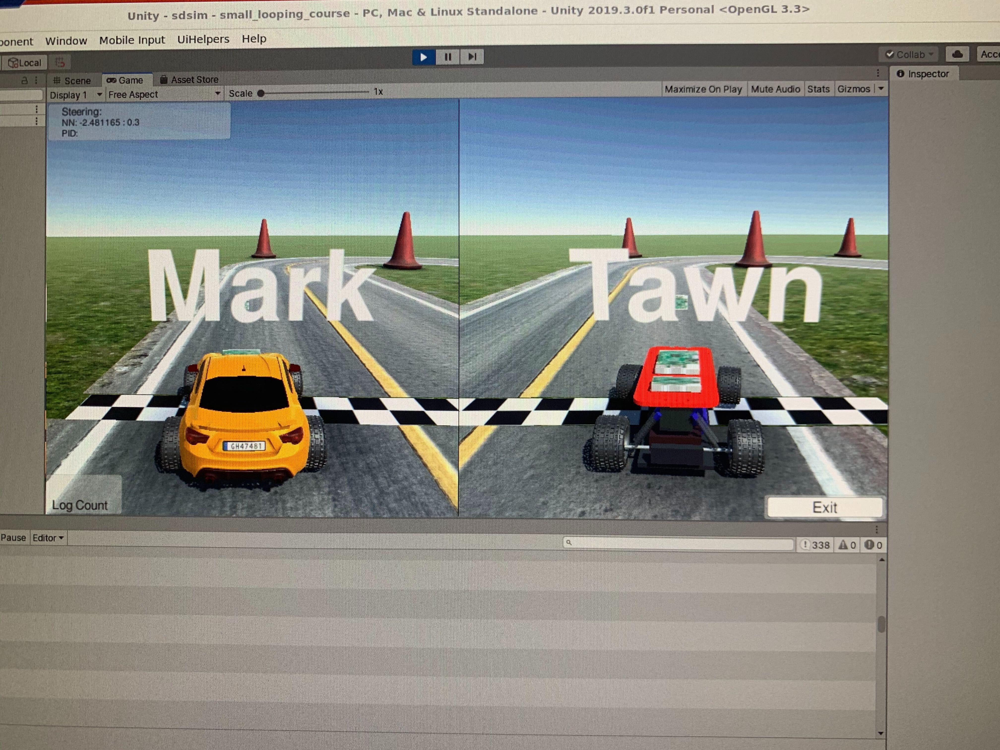

# Virtual Race League

We've taken the next step in DIY Robocars competitions. We are now hosting special events online! We welcome competitors from all over the world. Events will be scheduled by Chris Anderson and the Donkeycar maintainers. But this is by no means donkeycar only. Please read on, and we will provide two paths depending on whether you decide to use the donkeycar framework to race.

 

We will be broadcasting the race stream over Twitch. Check the event annoucement for the url. Race comepetitors will join a group Zoom chat event. Tawn will host the race server and share the stream over Zoom/Twitch. And we will see how things go.

## About the Sim server

We are using the [SDSandbox](https://github.com/tawnkramer/sdsandbox) open source project as the racing sim. This creates a 3d environment using [Unity](https://unity.com/) game creation tool. It uses [NVidia PhysX](https://developer.nvidia.com/physx-sdk) open source physics engine to simulate 4 wheeled vehicle dynamics. This sim also acts as a server, listening on TCP port 9091. This sends and receives JSON packets. More on the API later.

We use an OpenAI GYM style wrapper to interface with the server. The project for this wrapper is [gym-donkeycar](https://github.com/tawnkramer/gym-donkeycar).

You may build the server from the source project above, but [pre-built binaries](https://github.com/tawnkramer/gym-donkeycar/releases) for Ubuntu, Mac, and Windows. This has been tested on Ubuntu 18.04, Mac 10.13, and Windows 10.

## Setup for Donkeycar users

If you are using the donkeycar framework to race, you can use follow the guide to [setup the simulator](/guide/simulator/). If visuals directions help out, checkout the [Windows Sim Setup Screen-Cast on Youtube](https://youtu.be/wqQMmHVT8qw). Use this to practice before the race. When it comes time to race, modify your myconfig.py to have these two changes:

```
DONKEY_SIM_PATH = "remote"
SIM_HOST = "trainmydonkey.com"
```

This racing server will not always be running. We will bring it up for testing events and on race day. We are aiming to have it up from 7pm-9pm Pacific every night a week before race day. If not up, ask on Discord and we will try to get things running.

> Note: If you trained a donkey model, but wish to run it on a Jetson Nano or some platform where you are having troubles installing all the dependencies, [here's a single script](https://gist.github.com/tawnkramer/a74938653ab70e3fd22af1e4788a5001) you can use to run without any donkeycar or gym-donkeycar dependencies. Just pass it the model file name, the host name, and the car name. And it will run as a client to the race sim.

## Setup for Non-Donkeycar users

If you would like to roll your own client, we have some python code to get you started. 

* You will first want to download the sim [pre-built binary](https://github.com/tawnkramer/gym-donkeycar/releases) for your platform. Extract that where you like.

* Then clone the gym-donkeycar python project and install. If you are using a virtual environment, don't forget to activate it first. 
```bash
git clone https://github.com/tawnkramer/gym-donkeycar
pip install -e gym-donkeycar
```

* get the test client. Download via wget on Mac or Linux like:
```
wget https://raw.githubusercontent.com/tawnkramer/sdsandbox/master/src/test_client.py
```

 * or on Windows open a browser to [https://github.com/tawnkramer/sdsandbox/tree/master/src](https://github.com/tawnkramer/sdsandbox/tree/master/src)
 * then right click on test_client.py and choose "Save link as..." and choose a location on your PC.

 * start up the simulator and let it get to the menu screen. 
 * run the test client like 
 
 ```
 python3 test_client.py
 ```

Checkout test_client.py to see what's going there. Class SimpleClient connects to the host of your choosing. Then it sends a load scene command depending on which course you want to try. It then sends some car visual configuration, and then some camera config information. Then it enters an update loop.

You can try changing the num_clients variable to 2 or more clients. See how the sim can handle them.

The test client will send random steering command for time_to_drive = 1.0 seconds. Then quit.

During that time, the telemetry messages will come into SimpleClient::on_msg_recv. See them printed out for you. Also take a look at the 'test.png' that it writes to get a feel for what the camera looks like.

There's some comments in there explaining the camera configuration in detail. If you have a custom camera setup, hopefully we can come close to matching it with these controls.

When it's time to race, change the variable:
```
host = "trainmydonkey.com"
```

Be sure to enable controls to start the car on your command. We will likely be old school calling 3, 2, 1, GO! over video chat.

## Getting Help

There's a lot to learn. And come to [Discord](https://discord.gg/JGQUU8w) to get some help. Check out the #virtual-racing-league channel there.


