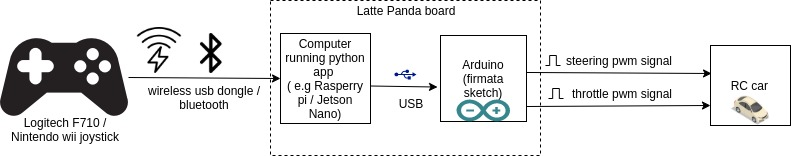
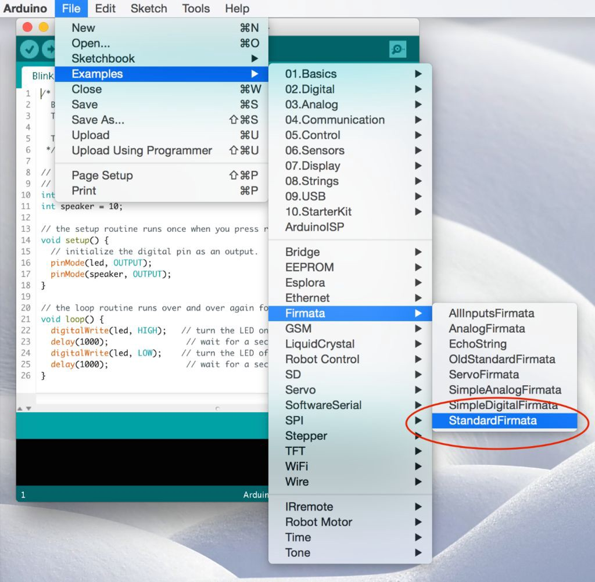
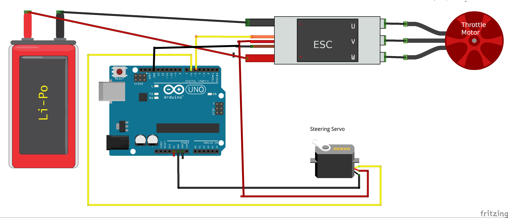

# Acutators

> Oh noes, nothing in here except Arduino actuator ! This section needs expansion!

## Arduino
Arduino can be used in the following fashion to generate PWM signals to control the steering and throttle.

For now the Arduino mode is only tested on the [Latte Panda Delta (LP-D)](https://www.lattepanda.com/products/lattepanda-delta-432.html) board.
However it should be straigtforward to use it with Raspberry Pi / Jetson Nano (instead of PCA 9685).

Refer to the below block diagram to understand where things fits in.



Arduino board should be running the standard firmata sketch (This sketch comes by default when you download the arduino tool). Load the standard firmata sketch (from _Examples > Firmata > StandardFirmata_) onto the Arduino.
 
Further **pymata_aio_** python package needs to be installed on the car computer via _pip3 install pymata_aio_.

As shown in the block-diagram above LattePanda combines both the x86 CPU and the Connected Arduino into a single board.

The following diagram shows how to connect the Arduino pins to steering servo and ESC.


Note that the power for the servo is provided by the ESC battery elemininator circuit (BEC) which most ESC's provide.
This is done to avoid supplying the entire servo power from Arduino's 5v.
In large RC cars the servo can drag up to 2 amps, which lead to a destruction of the Arduino.

### Calibration
Note that the calibration procedure/values are slightly different for the Arduino (than PCA9685).
Note that 90 is the usual midpoint (i.e. 1.5 ms pulse width at 50 Hz), so it is recommended to start
 with 90 and adjust +/- 5 until you figure the desired range for steering / throttle.
```bash
(env1) jithu@jithu-lp:~/master/pred_mt/lp/001/donkey$ donkey calibrate --arduino --channel 6
using donkey v2.6.0t ...

pymata_aio Version 2.33	Copyright (c) 2015-2018 Alan Yorinks All rights reserved.

Using COM Port:/dev/ttyACM0

Initializing Arduino - Please wait...
Arduino Firmware ID: 2.5 StandardFirmata.ino
Auto-discovery complete. Found 30 Digital Pins and 12 Analog Pins


Enter a PWM setting to test(0-180)95
Enter a PWM setting to test(0-180)90
Enter a PWM setting to test(0-180)85
...
```
Note the **--arduino** switch passed to the calibrate command. Further note that the arduino pin being
 calibrated is passed via the **--channel** parameter.

### Using the arduino actuator part

The following snippet illustrates how to exercise the Arduino actuator in the drive() loop:

```python
    #Drive train setup
    arduino_controller = ArduinoFirmata(
                                    servo_pin=cfg.STEERING_ARDUINO_PIN,
                                    esc_pin=cfg.THROTTLE_ARDUINO_PIN)

    steering = ArdPWMSteering(controller=arduino_controller,
                        left_pulse=cfg.STEERING_ARDUINO_LEFT_PWM,
                        right_pulse=cfg.STEERING_ARDUINO_RIGHT_PWM)

    throttle = ArdPWMThrottle(controller=arduino_controller,
                        max_pulse=cfg.THROTTLE_ARDUINO_FORWARD_PWM,
                        zero_pulse=cfg.THROTTLE_ARDUINO_STOPPED_PWM,
                        min_pulse=cfg.THROTTLE_ARDUINO_REVERSE_PWM)

    V.add(steering, inputs=['user/angle'])
    V.add(throttle, inputs=['user/throttle'])
```

Refer to templates/arduino_drive.py for more details.