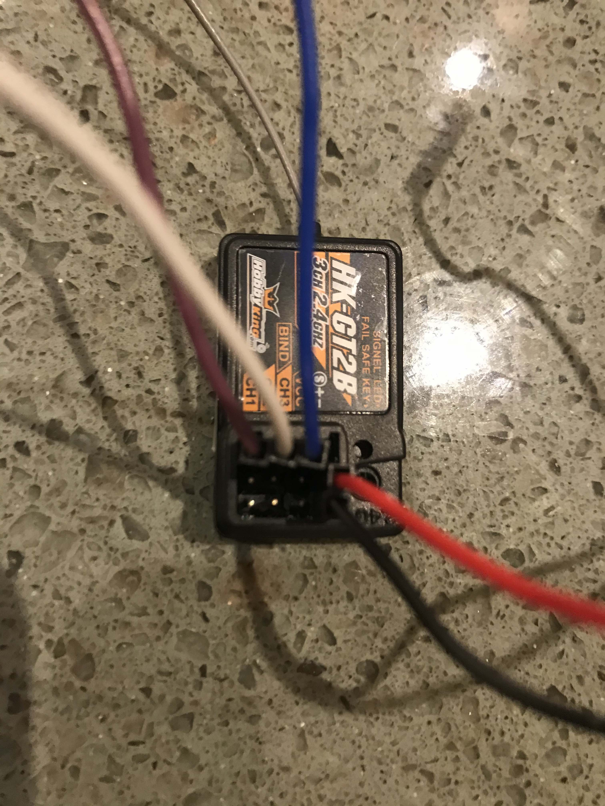

# Controller Parts

## Web Controller

The default controller to drive the car with your phone or browser. This has a web live preview of camera. Control options include:

1. A virtual joystick
2. The tilt, when using a mobile device with supported accelerometer
3. A physical joystick using the web adapter. Support varies per browser, OS, and joystick combination.
4. Keyboard input via the 'ikjl' keys.

> Note: Recently iOS has [disabled default Safari](https://www.macrumors.com/2019/02/04/ios-12-2-safari-motion-orientation-access-toggle/) access to motion control. 

## Joystick Controller

Many people find it easier to control the car using a game controller. There are several parts that provide this option.

The default web controller may be replaced with a one line change to use a physical joystick part for input. This uses the OS device /dev/input/js0 by default. In theory, any joystick device that the OS mounts like this can be used. In practice, the behavior will change depending on the model of joystick ( Sony, or knockoff ), or XBox controller and the Bluetooth driver used to support it. The default code has been written and tested with a [Sony brand PS3 Sixaxis controller](https://www.ebay.com/sch/i.html?_nkw=Sony+Playstation+Dualshock+PS3+controller+OEM). Other controllers may work, but will require alternative Bluetooth installs, and tweaks to the software for correct axis and buttons.

### These joysticks are known to work:

* [Logitech Gamepad F710](https://www.amazon.com/Logitech-940-000117-Gamepad-F710/dp/B0041RR0TW)
* [Sony PS3 Sixaxis OEM](https://www.ebay.com/sch/i.html?&_nkw=Sony+PS3+Sixaxis+OEM) (Not compatible with Jetson Nano)
* [Sony PS4 Dualshock OEM](https://www.ebay.com/sch/i.html?&_nkw=Sony+PS4+Dualshock+OEM)
* [WiiU Pro](https://www.amazon.com/Nintendo-Wii-U-Pro-Controller-Black/dp/B00MUY0OFU)
* [XBox Controller](https://www.amazon.com/Xbox-Wireless-Controller-Blue-one/dp/B01M0F0OIY)
* [SteelSeries Nimbus](https://www.amazon.com/gp/product/B01AZC3III) (works only on TX2 jetpack 4.2+, may work on the Nano)

These can be enabled by finding the CONTROLLER_TYPE in your myconfig.py and setting it to the correct string identifier ( after disabling the comment ).

These can be used plugged in with a USB cable. It's been much more convenient to setup Bluetooth for a wireless control.

There are controller specific setup details below.

> Note: If you have a controller that is not listed below, or you are having troubles getting your controller to work or you want to map your controller differently, see [Creating a New or Custom Game Controller](./#creating-a-new-or-custom-game-controller). 

### Change myconfig.py or run with --js

```bash
python manage.py drive --js
```

Will enable driving with the joystick. This disables the live preview of the camera and the web page features. If you modify myconfig.py to make `USE_JOYSTICK_AS_DEFAULT = True`, then you do not need to run with the `--js`.


## PS3 Controller

### Bluetooth Setup

Follow [this guide](https://pythonhosted.org/triangula/sixaxis.html). You can ignore steps past the 'Accessing the SixAxis from Python' section. I will include steps here in case the link becomes stale.

``` bash
sudo apt-get install bluetooth libbluetooth3 libusb-dev
sudo systemctl enable bluetooth.service
sudo usermod -G bluetooth -a pi
```

Reboot after changing the user group.

Plug in the PS3 with USB cable. Hit center PS logo button. Get and build the command line pairing tool. Run it:

```bash
wget http://www.pabr.org/sixlinux/sixpair.c
gcc -o sixpair sixpair.c -lusb
sudo ./sixpair
```

Use bluetoothctl to pair

```bash
bluetoothctl
agent on
devices
trust <MAC ADDRESS>
default-agent
quit
```

Unplug USB cable. Hit center PS logo button.

To test that the Bluetooth PS3 remote is working, verify that `/dev/input/js0` exists:

```bash
ls /dev/input/js0
```

#### Troubleshooting

In case the BT connection on the Raspberry Pi does not work, you see might something like this in `bluetoothctl`:

```text
[NEW] Controller 00:11:22:33:44:55 super-donkey [default]
[NEW] Device AA:BB:CC:DD:EE:FF PLAYSTATION(R)3 Controller
[CHG] Device AA:BB:CC:DD:EE:FF Connected: yes
[CHG] Device AA:BB:CC:DD:EE:FF Connected: no
[CHG] Device AA:BB:CC:DD:EE:FF Connected: yes
[CHG] Device AA:BB:CC:DD:EE:FF Connected: no
[CHG] Device AA:BB:CC:DD:EE:FF Connected: yes
...
[CHG] Device AA:BB:CC:DD:EE:FF Connected: yes
[CHG] Device AA:BB:CC:DD:EE:FF Connected: no
[bluetooth]#
```

Try updating the Linux kernel and firmware by running:

```bash
sudo rpi-update
```

And then reboot:

```bash
sudo reboot
```

### Charging PS3 Sixaxis Joystick

For some reason, they don't like to charge in a powered USB port that doesn't have an active Bluetooth control and OS driver. This means a phone type USB charger will not work. Try a powered Linux or mac laptop USB port. You should see the lights blink after plugging in and hitting center PS logo.

After charging, you will need to plug-in the controller again to the Pi, hit the PS logo, then unplug to pair again.

### New Battery for PS3 Sixaxis Joystick

Sometimes these controllers can be quite old. Here's a link to a [new battery](http://a.co/5k1lbns). Be careful when taking off the cover. Remove 5 screws. There's a tab on the top half between the hand grips. You'll want to split/open it from the front and try pulling the bottom forward as you do, or you'll break the tab off as I did.

### PS3 Mouse problems on Linux

Sometimes when you plug-in the PS3 joystick it starts taking over your mouse. If you want to prevent that, you can run this:

```bash
xinput set-prop "Sony PLAYSTATION(R)3 Controller" "Device Enabled" 0
```

## PS4 Controller

The following instructions are based on [RetroPie](https://github.com/RetroPie/RetroPie-Setup/wiki/PS4-Controller#installation) and [ds4drv](https://github.com/chrippa/ds4drv).

#### Install `ds4drv`

Running on your pi over ssh, you can directly install it:

```bash
sudo /home/pi/env/bin/pip install ds4drv
```

#### Grant permission to `ds4drv`

```bash
sudo wget https://raw.githubusercontent.com/chrippa/ds4drv/master/udev/50-ds4drv.rules -O /etc/udev/rules.d/50-ds4drv.rules
sudo udevadm control --reload-rules
sudo udevadm trigger
```

#### Run `ds4drv`

```bash 
ds4drv --hidraw --led 00ff00
```

If you see `Failed to create input device: "/dev/uinput" cannot be opened for writing`, reboot and retry. Probably granting permission step doesn't take effect until rebooting.
Some controllers don't work with `--hidraw`. If that's the case try the command without it. `--led 00ff00` changes the light bar color, it's optional.

#### Start controller in pairing mode

Press and hold **Share** button, then press and hold **PS** button until the light bar starts blinking. If it goes **green** after a few seconds, pairing is successful.

#### Run `ds4drv` in background on startup once booted

```bash
sudo nano /etc/rc.local
```

paste:

```text
/home/pi/env/bin/ds4drv --led 00ff00
```

Save and exit. Again, with or without `--hidraw`, depending on the particular controller you are using.

To disconnect, kill the process `ds4drv` and hold **PS** for 10 seconds to power off the controller.

## XBox One Controller

### bluetooth pairing

This code presumes the built-in linux driver for 'Xbox Wireless Controller'; this is pre-installed on Raspbian, so there is no need to install any other drivers.  This will generally show up on /dev/input/js0.  There is another userland driver called xboxdrv; this code has not been tested with that driver.

The XBox One controller requires that the bluetooth disable_ertm parameter be set to true; to do this:

* edit the file `/etc/modprobe.d/xbox_bt.conf`  (that may create the file; it is commonly not there by default)
* add the line: `options bluetooth disable_ertm=1`
* reboot so that this takes affect.
* after reboot you can verify that `disable_ertm` is set to true entering this
  command in a terminal:

  ```bash
  cat /sys/module/bluetooth/parameters/disable_ertm
  ```

* the result should print 'Y'. If not, make sure the above steps have been done correctly.

Once that is done, you can pair your controller to your Raspberry Pi using the bluetooth tool. Enter the following command into a bash shell prompt:  

```bash
sudo bluetoothctl
```

That will start blue tooth pairing in interactive mode. The remaining commands will be entered in that interactive session. Enter the following commands:

```text
agent on
default-agent
scan on
```

That last command will start the Raspberry Pi scanning for new bluetooth devices. At this point, turn on your XBox One controller using the big round 'X' button on top, then start the pairing mode by pressing the 'sync' button on the front of the controller.  Within a few minutes, you should see the controller show up in the output something like this;

```text
[NEW] Device B8:27:EB:A4:59:08 XBox One Wireless Controller
```

Write down the MAC address, you will need it for the following steps.  Enter this command to pair with your controller:

```text
connect YOUR_MAC_ADDRESS
```

where `YOUR_MAC_ADDRESS` is the MAC address you copied previously.  If it does not connect on the first try, try again.  It can take a few tries.  If your controller connects, but then immediately disconnects, your disable_ertm setting might be wrong (see above).  

Once your controller is connected, the big round 'X' button on the top of your controller should be solid white.  Enter the following commands to finish:

```text
trust YOUR_MAC_ADDRESS
quit
```

Now that your controller is trusted, it should automatically connect with your Raspberry Pi when they are both turned on.  If your controller fails to connect, run the bluetoothctl steps again to reconnect.

## RC Controller
If you bought an RC car then it might have come with a standard 2.4GHz car 
radio and receiver as in this picture. This can be used to drive the car. 



The connectors from lift to right are (S)ignal, +, -. Just attach the +/- to a free RPi 3.3V  and ground pin or pick these up from the other end of the PCA9685. These receivers seem to work fine with 3.3V as well. It doesn't matter which +, - you are choosing. 

Then connect the PWM signal pins to three wires, in this example CH1 - purple, CH2 - white, CH3 - blue. The other ends can go an any RPi GPIO, except for the +, - and SCL, SDA pins.  CH-1 is for steering, CH-2 for throttle and CH-3 is linked to a press button on the remote control. The default connections are steering - GPIO 26, throttle - GPIO 20, channel 3 (for record deletion) - GPIO 19.

The `basic` template which you install with `donkey createcar --path ~/mycar --template basic` has and additional function `manage.py calibrate` which you should use to zero your angle and throttle PWM signal. 

You must also have `pigpio` installed. Do so with these commands: `sudo apt update && sudo apt install python3-pigpio & & sudo systemctl enable pigpiod & sudo systemctl start pigpiod`

> Note: The PWM signal drifts over time. Hence check your calibration regularly before starting recording.

## Creating a New or Custom Game Controller

To discover or modify the button and axis mappings for your controller, you can use the [Joystick Wizard](/utility/donkey/#joystick-wizard). The Joystick Wizard will write a custom controller named 'my_joystick.py' to your mycar folder.  To use the custom controller, set `CONTROLLER_TYPE="custom"` in your myconfig.py.
