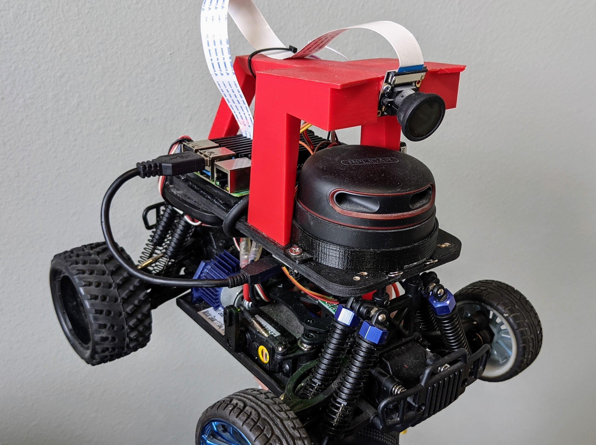
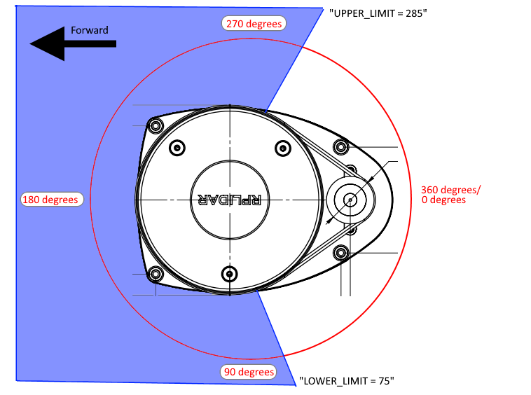

# Lidar

A Lidar sensor can be used with Donkeycar to provide obstacle avoidance or to help navigate on tracks with walls. It records data along with the camera during training and this can be used for training

 
## Supported Lidars

We currently only support the RPLidar series of sensors, but will be adding support for the similar YDLidar series soon. 

We recommend the [$99 A1M8](https://amzn.to/3vCabyN) (12m range) 


## Hardware Setup

Mount the Lidar underneath the camera canopy as shown above (the RPLidar A2M8 is used there, but the A1M8 mounting is the same). You can velcro the USB adapter under the Donkey plate and use a short USB cable to connect to one of your RPi or Nano USB ports. It can be powered by the USB port so there's no need for an additional power supply.

## Software Setup

Lidar requires the glob library to be installed. If you don't already have that, install it with `pip3 install glob2`

Also install the Lidar driver: `pip3 install rplidar`

Right now Lidar is only supported with the basic template. Install it as follows:

`donkey createcar --path ~/lidarcar --template basic`

Then go to the lidarcar directory and edit the myconfig.py file to ensure that the Lidar is turned on. The upper and lower limits should be set to reflect the areas you want your Lidar to "look at", omitting the areas that are blocked by parts of the car body. An example is shown below. For the RPLidar series, 0 degrees is in the direction of the motor (in the case of the A1M8) or cable (in the case of the A2M8)

```
# LIDAR
USE_LIDAR = True
LIDAR_TYPE = 'RP' #(RP|YD)
LIDAR_LOWER_LIMIT = 44 # angles that will be recorded. Use this to block out obstructed areas on your car and/or to avoid looking backwards. Note that for the RP A1M8 Lidar, "0" is in the direction of the motor 
LIDAR_UPPER_LIMIT = 136
```
 


