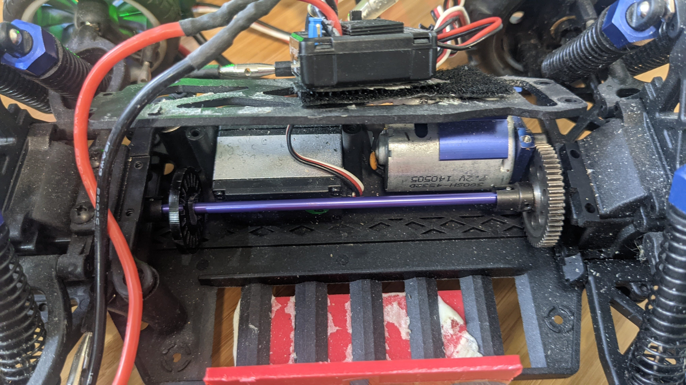
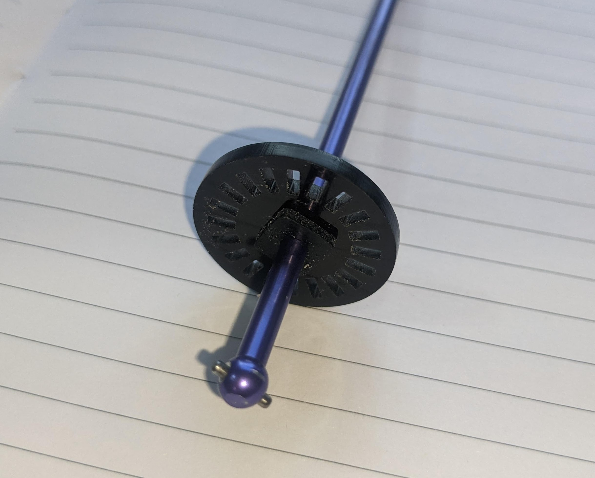
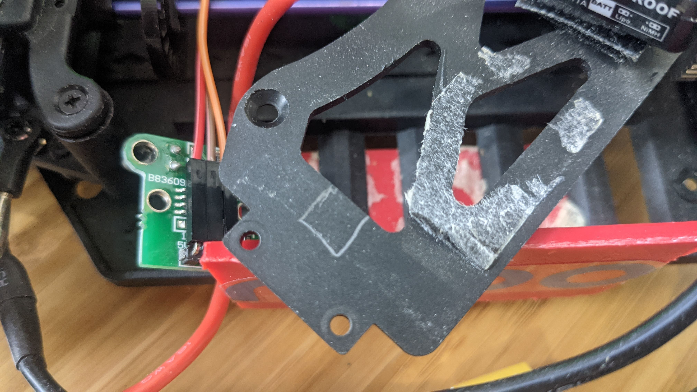
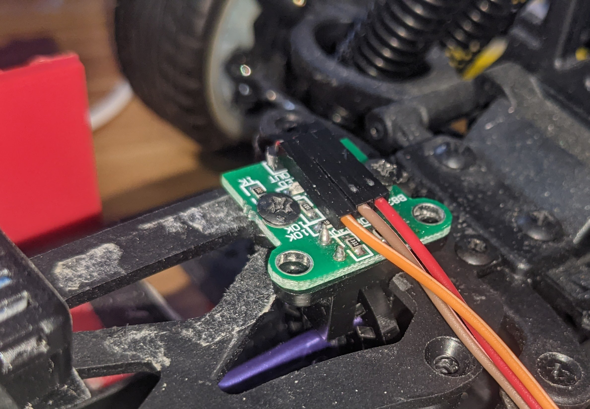

# Odometry

Odometry is way to calculate the speed and distance travelled of the car by measuring the rotation of its wheels using a sensor called an rotary encoder. This encoder can be on the motor, on the main drive shaft or on individual wheels. The advantage of using an encoder is that it "closes the loop" with your throttle, so your car can reliably command an actual velocity rather than just issuing a motor control which will produce a faster or slower velocity depending on the slope of the track, the surface or mechanical friction in your drive train while turning. In short, an encoder gives you much better control over your speed.

Encoders come in various forms:
* Quadrature encoders use hall-effect sensors to measure magnetic pulses as the shaft turns, and have the advantage of being very precise as well as being able to tell the difference between forward and reverse rotation
* Single-output encoders are like quadrature encoders but they can not determine the direction of motion
* Optical encoders are typicall a LED/Light sensor combo with a disk that has slots cut in in-between them. As the disk rotates, the light is interruprted and those pulses are counted. These sensors are cheap and easy to install but cannot determine the direction of rotation

There are several ways to read encoders with Donkey:
* Directly with the RaspberryPi's GPIO pins. This is best for optical encoders, since they don't generate as many pulses as a quadrature encoder and the RPi will miss fewer of them as it task-swaps between the various Donkeycar parts
* With an Arduino or Teensy. This is best for quadrature encoders, since the Arduino/Teensy is 100% devoted to counting pulses. It transmits the count to the RPi via the USB serial port when requested by Donkeycar, which lightens the processing load for the Rpi
* With an Astar board. This is just a fancy Arduino, but if you have one, it makes for a neat installation


## Supported Encoders

Examples of rotary encoders that are supported:

* Optical encoder sensors and discs [Available from many sources on Amazon](https://amzn.to/3s05QmG)
* Quadrature encoders. [Larger, cheaper](https://amzn.to/3liBUjj), [Smaller, more expensive](https://www.sparkfun.com/products/10932)

## Hardware Setup

How you attach your encoder is up to you and which kind of encoder you're using. For example, [here's](https://diyrobocars.com/2020/01/31/how-to-add-an-encoder-to-the-donkeycar-chassis/) one way to put a quadrature encoder on the main drive shaft. [Here](https://guitar.ucsd.edu/maeece148/index.php/Project_encoders) is a more complex setup with dual encoders. 

But this is the easiest way to do it, with a cheap and simple optical encoder on the main drive shaft of a standard Donkeycar chassis (if your chassis is different, the same overall approach should work, although you may have to find a different place to mount the sensor):

First, unscrew the plate over the main drive shaft. Tilt the rear wheels back a bit and you should be able to remove the shaft.



Now enlarge the hole in the optical encoder disc that came with your sensor (use a drill or Dremel grinding stone) so you can slip it onto the shaft. Stretch a rubber grommet (you can use the sort typically included with servos to mount them, but any one of the right size will do) over the shaft and push it into the encoder disc hole. If you don't have a grommet, you can wrap tape around the shaft until it's large enough to hold the disc firmly. Once you've ensured it's in the right place, use a few drops of superglue or hot glue to hold it in place)




Cut out a small notch (marked in pencil here) in the plate covering the drive shaft, so you can mount the encoder sensor there, ensuring that the disc can turn freely in the gap in front of the steering servo



Now replace the plate and drill two holes so you can screw in the encoder sensor. Slide the disc along the shaft so that it doesn't bind on the sensor. 



Use three female-to-female jumper cables and connect the sensor to your RPi GPIO pins as follows. Connect the GND, V+ (which might say 5V or 3.3V) and data pin (which will say "Out or "D0") to the RPi 5V, Ground and GPIO 13 as shown here (if your sensor encoder has four pins, ignore the one that says "A0"):


## Software Setup

Enable odometry in `myconfig.py`.

```HAVE_ODOM = True                   # Do you have an odometer/encoder 
ENCODER_TYPE = 'GPIO'            # What kind of encoder? GPIO|Arduino|Astar 
MM_PER_TICK = 12.7625               # How much travel with a single tick, in mm. Roll you car a meter and divide total ticks measured by 1,000
ODOM_PIN = 13                        # if using GPIO, which GPIO board mode pin to use as input
ODOM_DEBUG = False                  # Write out values on vel and distance as it runs
```

If you are using an Arduino or Teensy to read your encoder, select 'Arduino' in the myconfig.py file libe above. The microcontroller should be flashed using the Arduino IDE with [this sketch](https://github.com/zlite/donkeycar/tree/master/donkeycar/parts/encoder/encoder). Make sure you check the sketch using the "test_encoder.py code in the Donkeycar tests folder to make sure you've got your encoder plugged into the right pins, or edit it to reflect the pins you are using.