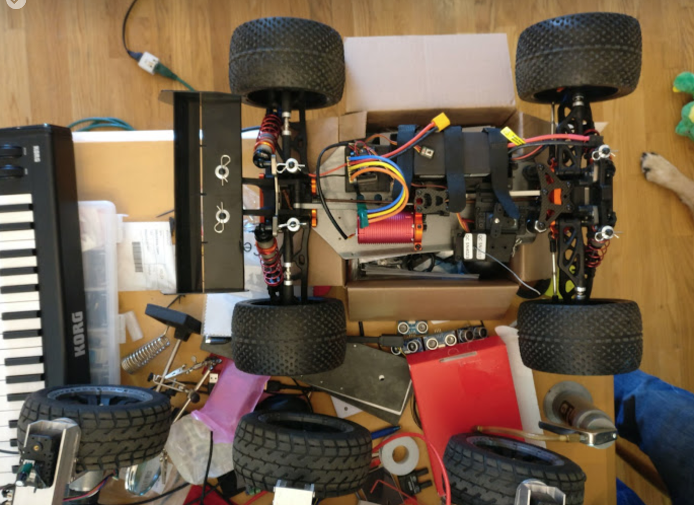
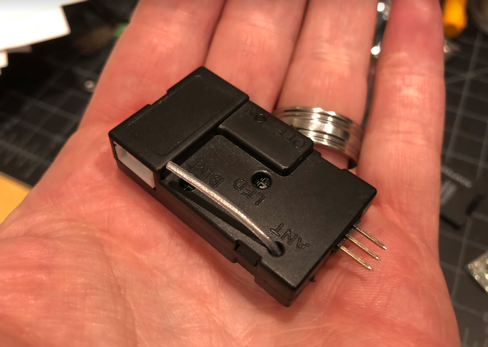

# Roll Your Own Car

## The Quick and Dirty

* Your car needs to be easy to control from a Raspberry Pi
* Your car needs to be not too large, because it will be too heavy and dangerous (and expensive)
* Your car needs to be not too small, because it needs to carry a certain minimum amount of equipment
* Your car needs to meet minimum performance standards in power and control for the model to make sense for it
* Your car needs to be smooth to control even at low speeds

This generally means:

* Your car needs to have a speed controller for the motor (ESC) that takes a standard RC 3-pin control signal (RC PWM style)
* Your car needs to have a steering servo that takes a standard RC 3-pin control signal (RC PWM style)
* Your car needs to have a radio receiver that contains standard 100-mil (2.54 mm) pin headers for each of the ESC and the steering servo.
* Your car needs to be between 1/18th scale (smallest end) and 1/8th scale (largest end) if you want to race in the DIYRobocars race.
* Your car needs to either use a brushed motor, or a sensored brushless motor. Sensorless brushless motors are too rough at low speeds.  If you buy a car with a brushless motor included it is invariably a sensorless brushless motor and will need to be replaced along with the ESC.

Other options are perhaps possible, see the end of this document.

Many car builders end up looking at "integrated" RC hobby cars, because they
are typically cheaper. However, the reason these are cheaper, is that they will
integrate many parts of electronics and mechanics into a single package, which
means that we can't intersect the appropriate signals to control the car with a
Raspberry Pi. In fact, the expected signals may not even exist at all in an
integrated car.

Here is an example of an integrated RX and ESC - typically these should be avoided:

You also need to know some things about electronics, such as the difference
between power rails and control signals, what the duration of a microsecond is,
and how Volts, Amperes, Watts, Hours, Ohms, and other measurement units relate.

## Servo Specifics

An RC servo is used for controlling the steering wheels of the car. This servo
typically expects around 4.8V to 6V input on the power wire (varies by car) and
a PWM control signal on the signal wire. Typically, the three wires are colored
black-red-white, or brown-red-yellow, where the dark wire (black/brown) is ground,
and the center wire (red) is power, and the light wire (white/yellow) is control.

The control signal is RC-style PWM, where one pulse is sent 60 times a second,
and the width of this pulse controls how left/right the servo turns. When this
pulse is 1500 microseconds, the servo is centered; when the pulse is 1000
microseconds, the servo is turned all the way left (or right) and when the pulse
is 2000 microseconds, the servo is turned all the way in the other direction.
This is NOT the same kind of PWM that you would use to control the duty cycle of
a motor, or the brightness of a LED.

The power for the servo typically comes from the motor ESC, which has a BEC
(Battery Eliminator Circuit) built in.

## ESC Specifics

The role of the ESC is to take a RC PWM control signal (pulse between 1000 and
2000 microseconds) in, and use that to control the power to the motor so the
motor spins with different amounts of power in forward or reverse. Again, 1500
microseconds typically means "center" which for the motor means "dead stop."

The battery typically connects straight to the ESC using thicker wiring than the
simple control signals, because the motor draws many more amps than the control.
The ESC then connects on to the motor with equally thick power wiring. The
standard Donkey motor and ESC probably have a peak current of about 12A; a
1/8th scale RC car with powerful brushless motor can have a peak draw up to
200A!

Additionally, the ESC typically contains a linear or switching voltage converter
that outputs the power needed to control the steering servo; this is typically
somewhere in the 4.8V to 6V range. Most BECs built into ESCs will not deliver
more than about 1A of current, so it is not typically possible to power both the
steering servo and the Raspberry Pi from the BEC.

## Receiver Specifics

If you buy a "kit car" that is listed as "needs a receiver," then you don't need
to buy a receiver. The Raspberry Pi plus the PCA9685 board take the role of the
receiver, outputting control signals to the car. Buying a "kit car" that comes
with steering servo, motor, and ESC, but not with radio, is actually a great way
to make sure that the car you build will have the right signalling, because any
RC car with separate receiver will be designed for the appropriate PWM signals.

If your car comes with a receiver, make sure it has the appropriate three-pin
headers next to each other for steering servo and for ESC control. Some receivers
may have additional three-pin headers for additional channels, which may be empty
or may control fancy attachments like horns, lights, and so forth.

There is a modification to the Donkey car which uses the RC radio to drive the
car when collecting training data; this will give better control of the car than
you typically get with a PlayStation controller, or cell phone. However, it also
requires replacing the PCA9685 board with an external microcontroller, and
changing the software of the Donkey to use it.

Finally, some receivers can output, in addition to the PWM control signals, a
serial data packet that contains the control signals. An example of such a receiver
is the FS-i6B, which has 6 output channels for PWM signals, but can output 10
channels of data at 115,200 bps as serial data, which you can read with an external
microcontroller, or perhaps even with the Raspberry Pi (requries re-configuration
of the Pi boot loader, and custom modifications to the donkey software.)

## Batteries

The Donkey comes with a Nickel Metal Hydride battery (NiMH) which is just enough
to make its motor go, for a little bit of time (5-10 minutes) before needing a
recharge. The specifications on this battery are 6 cells, 1100 mAh. Because
NiHM batteries range from 0.9V to 1.35V with a "nominal" voltage of 1.2V, you can
expect to see voltages in the 5.4V to 8.1V range.

NiHM batteries have medium energy capacity per weight and volume. Thus, you can
improve the runtime and performance of the Magnet car by upgrading to a Lithium
Polymer battery (LiPo.) Typically, you will get a 2 cell battery (2S) and
Lithium batteries have 3.2V to 4.2V per cell, so you will see voltages in the
6.4V to 8.4V range. Additionally, Lithium Polymer batteries generally have higher
current capacity (amount of Amps the battery can deliver at one point while
driving) as well as energy storage (number of Amp Hours the battery stores when
fully charged) so it may also last longer.

Note that the amount of charge a battery can hold (how long it runs) is measured
in Ampere-hours, or milli-Ampere-hours, whereas the amount of current a battery
can instantaneously deliver while driving is measured simply in Amperes. But to
make things more confusing, Amperes are often re-calculated in terms of multiples
of the energy content, divided by one hour; this ratio is often called "C." Thus,
a LiPo rated for 10C and 2000 mAh, can deliver 20 Amperes of current while
driving. A NiHM rated for 5C and 1100 mAh can deliver 5.5 Amperes of current while
driving. Batteries typically will deliver more than the C rating for very short
amounts of time, but will heat up or build up internal resistance such that that
is not something you can rely on for normal operation.

For your custom car, be aware of the voltages needed for the ESC and motor of the
car, and make sure to get a battery that matches in voltage. Smaller RC cars will
come with NiMH for affordability, or 2S LiPo for power. Larger RC cars will use 3S
(11.1V) or 4S (14.8V) or even 6S (22.2V) Lithium batteries, and thus need to have
ESC and motor combinations to match.

Finally, be sure to get a charger that matches your battery. If you have a LiPo
battery, get a good Lithium battery charger, with a balancing plug that matches
your battery. Never discharge a Lithium battery below 3.2V per cell; if you let it
run dead, it will not want to be charged up to normal voltage again, and trying to
do so may very well overheat the batter and light it on fire! See YouTube pictures
of burning Teslas for what that can look like. Seriously, houses have burned down
because people have tried to save $10 by re-charging a Lithium battery that they
forgot to disconnect and it ran down too much. It's not worth it. Instead, get a
battery alarm, that you plug into the battery balance connector, and it beeps when
the battery has discharged so much that you should disconnect and recharge it.

## Physical Constraints

Adding the additional battery and electronics for self-driving to a toy car will
add more load than the car was initially designed for. For a large, 1/8th scale
car, this may not be much of a problem. For a small car, 1/18th scale or below, the
additional weight and top-heaviness will cause the car to not react well to the
steering output, which may cause the self-driving model to be less able to control
the car.

If you use a car that's not the standard Magnet, at a minimum, you will have to
figure out how to mount all the hardware securely. Just piling things on and hoping
wiring will keep it in place will not work for things that actually drive and turn.
Finding good mounting points, and making your own "base plate" with measurements
from the car you have, is likely to be necessary. You can build this base plate
using 3D printing, laser cutting, CNC milling, or even just drilling into a thin
piece of plywood, but getting a good fit to your chassis is important, so don't
rush it or try to cut corners.

Doug LaRue also built a [configurator](https://www.thingiverse.com/thing:2781404) in Thingiverse that enables people to easily make custom 3d printed plates.

## Other Options

Yes, you can make a self-driving car out of your 1/5th scale Nitro Dragster. You
will just have to learn even more about the different bits and pieces of the
solution, and figure out all the necessary integration yourself. The control
signals for a Nitro car are the same, so this might not even be hard. However, the
indoors arenas used for Donkey Racing Meetups do not allow fuel-burning cars, only
electric.

Yes, you can make a self-driving car out of a cheap two-wheel chassis that uses
a LM298 H-bridge with direct PWM control to "tank steer" two wheels. However, you
will have to adapt the Donkey software to output the right steering controls, and
you will additionally have to figure out how to wire up the H-bridge to the Pi in
a way that makes sense to you; the PWM signals output by the PCA9685 board are the
RC control kind, NOT the motor control kind! Also, most affordable two-wheel-drive
robot chassis are not actually big enough, strong enough, and mechanically
consistent enough to make for good Donkey Car candidates.
