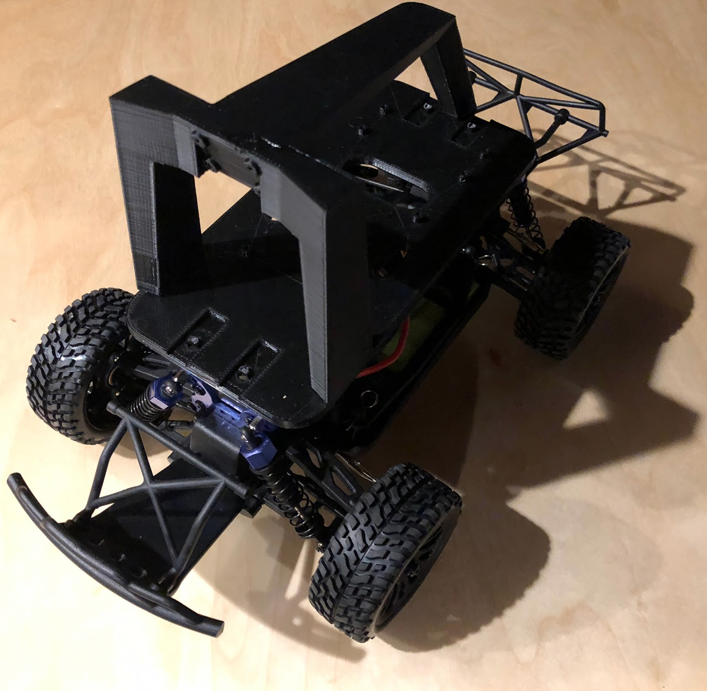
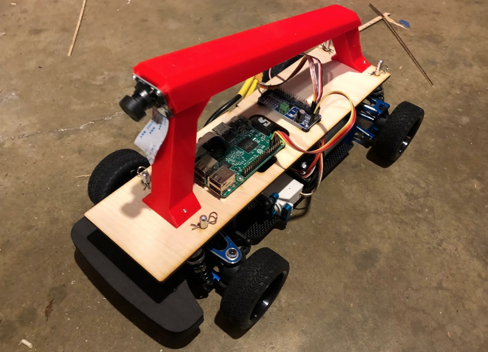

# Supported cars

## Magnet and HSP 94186
The magnet chassis was the first standard Donkey build.  However in many cases it may not be available.

Try searching for both the Magnet and HSP 94186 on ebay, banggood, ali express etc.

The HSP 94186 is the same as the Magnet and will work.  If you speak mandarin it is always available on Taobao.

https://item.taobao.com/item.htm?spm=a230r.1.14.1.478a6da8CUjrQQ&id=6004880592&ns=1&abbucket=12#detail

## Exceed Desert Monster, Short Course Truck, and Blaze
The Desert Monster, SCT and Blaze are made by the same manufacturer as the Magnet and has the same motor and ESC.  The chassis is slightly different so it requires an adapter and some extra hardware to work with the standard donkey platform.  With the adapters the camera placement will be identical to the Magnet and should be able to share models.

It is worth noting that the Desert Monster and SCT also has some nice characteristics including narrower, more road friendly tires and the Blaze has a slightly narrower stance which makes it less likely to hit things.

Tu purchase one of these cars follow the following links:

*  Exceed Desert Monster [Blue](http://amzn.to/2HLXJmc),  [Red](http://amzn.to/2pnIitV)
*  Exceed Short Course Truck  [Blue](https://amzn.to/2KsYF1e),  [Red](https://amzn.to/2rdtQ8z)
*  Exceed Blaze [Hyper Blue](https://amzn.to/2rf4MgS), [Yellow](https://amzn.to/2jlf3EA)

To assemble one of these you will need some additional parts than the standard build, these can be purchased as a kit on the donkey store at: Purchase: [Donkey Store](https://squareup.com/store/donkeycar)

| Part Description   | Link  | Approximate Cost |
|---|----|---|
|3D printed Adapters | Files: [thingiverse.com/thing:2260575](http://www.thingiverse.com/thing:2260575)| $10 |
|Chassis Clips | [Amazon](http://amzn.to/2FNSCFI) | $5|

To assemble first remove the plastic cover and roll cage then unscrew the posts that hold up the cover and replace with the adapters.

Visual instructions to follow.

## Tamaya TT-01 (Advanced Build)

The TT-01 is a new build that is a higher end version of the Donkey.  This is an advanced build and requires existing RC skills or the desire to learn them - along with some willingness to trial and error.  For first time builders we recommend the Magnet.  That said, it has some pros and cons that people should be aware of:
Pros:

* Better kinematics and traction on smooth surfaces - basically this means it will corner better
* Larger build area for adding other sensors.
* Globally available with several clones.

Cons:

* Assembly required! - you will need to supply your own ESC, battery, servo, pinion gear and motor.
* Needs to run on a smooth surface like a driveway or parking lot.
* Larger size requires a larger 3D printer to print chassis, otherwise purchase at the Donkeystore.
* More expensive

In addition to the standard donkey parts, Raspberry Pi etc, you will need to buy the following components.

| Part Description   | Link  | Approximate Cost |
|------|-------------|------------------|
|TT-01 Clone Chassis| [eBay](https://www.ebay.com/itm/Alloy-Carbon-TT01-TT01E-Shaft-Drive-1-10-4WD-Racing-Car-Chassis-Frame-Kit/261607459461?_trkparms=aid%3D555019%26algo%3DPL.BANDIT%26ao%3D1%26asc%3D20150817211623%26meid%3Da9b0995835f04dc2ae610bb9de46099b%26pid%3D100505%26rk%3D1%26rkt%3D1%26%26itm%3D261607459461&_trksid=p2045573.c100505.m3226) other TT01s may be used| $130|
|ESC|https://hobbyking.com/en_us/hobbyking-x-car-45a-brushed-car-esc.html |10.60|
|Brushed Motor |https://hobbyking.com/en_us/mabuchi-rs-540sh-6527-brushed-motor-90w.html |$5|
|Steering Servo|https://hobbyking.com/en_us/hobbykingtm-hk15138-standard-analog-servo-4-3kg-0-17sec-38g.html| $5|
|Battery |https://hobbyking.com/en_us/turnigy-5000mah-2s1p-20c-hardcase-pack-roar-approved-de-warehouse.html or similar 2S 5000 mAh battery| $21|
|Pinion Gear| https://www.amazon.com/gp/product/B001BHGIBG/ref=oh_aui_detailpage_o08_s00?ie=UTF8&psc=1|$7|
|TT01 Plastics | Thingiverse: https://www.thingiverse.com/thing:2805287 or Donkeystore: https://squareup.com/store/donkeycar | $50|

Note: purchasing from Hobbyking is tricky.  They can ship from multiple warehouses and it can be expensive and time consuming if shipping from one overseas.  You may need to buy an alternate component if one of the items above are not available in your local warehouse.

## If You Want to Roll Your Own
It's totally possible to diverge from the main Donkey build, and still have a car that
drives well and is fun to work with. We've seen a large variety of cars in the various
Donkey competitions around the world.

However, when you want to diverge, there are several things you need to know, or you
will not be successful. There are many cost and quality trade-offs where the lower
cost options simply won't work. We've already worked hard to find the cheapest
available options that will work, so you should not expect to choose other options to
save money. Rolling your own is more about learning, experimentation, and going to new
and uncharged places.

To find out more about what you need, see [Roll Your Own](/roll_your_own.md).
