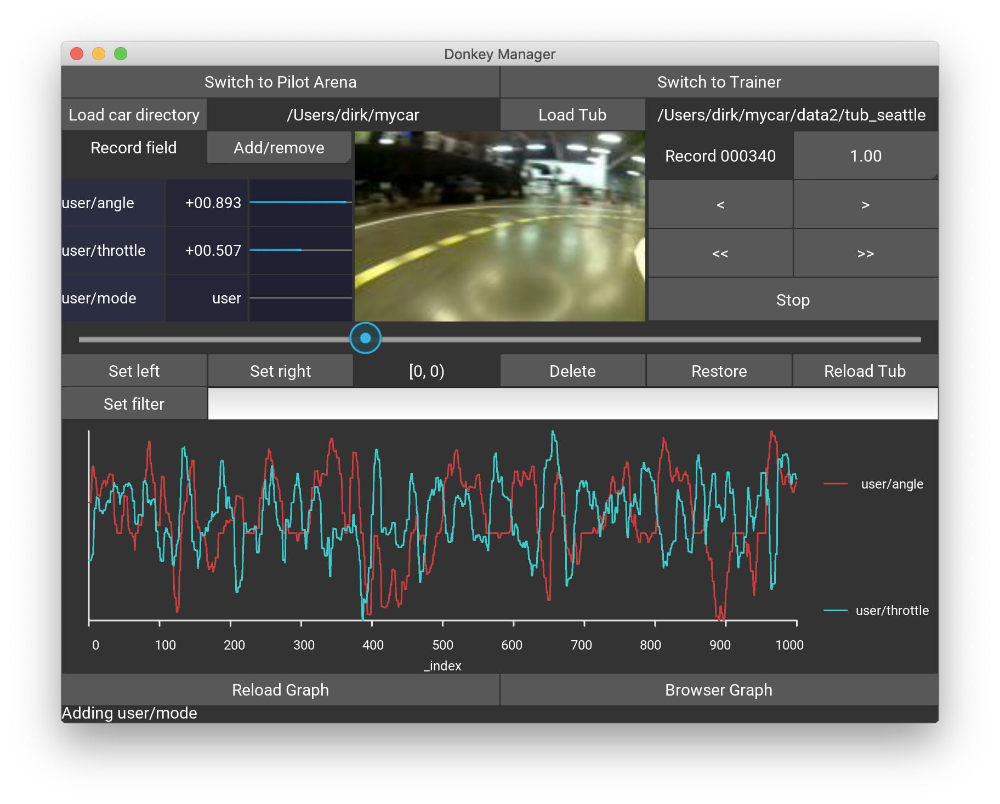
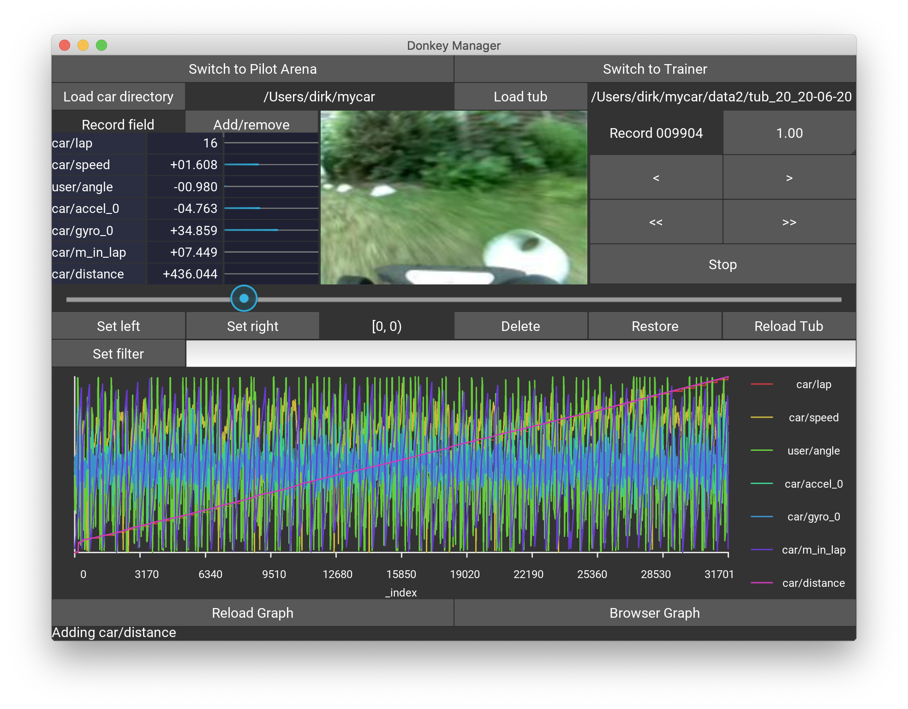
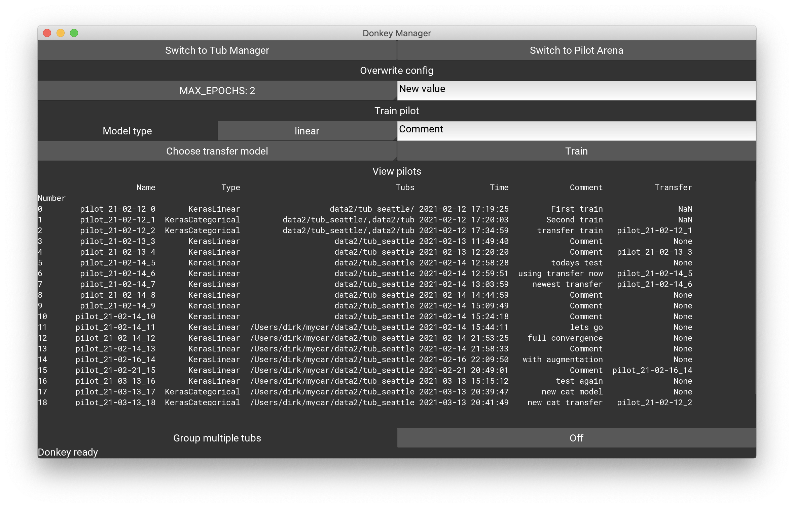
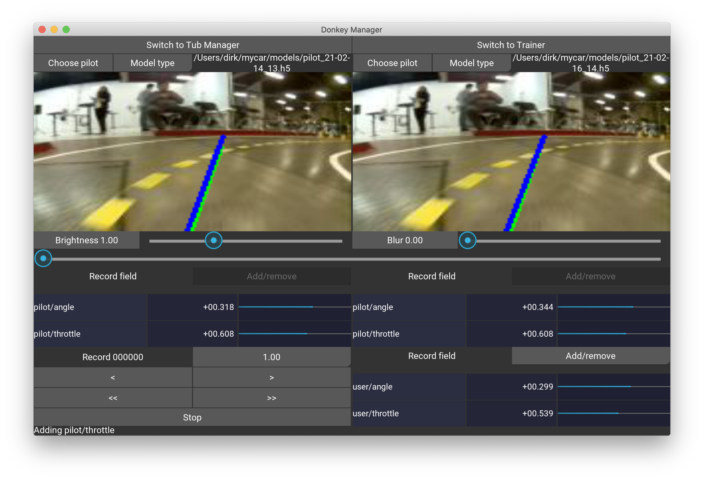
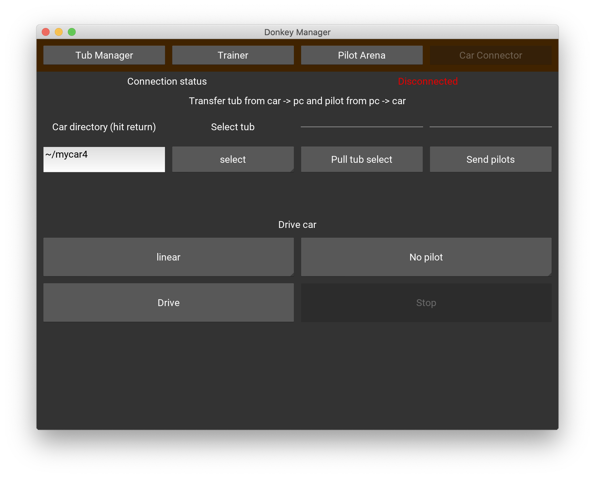

# Donkey UI

The Donkey UI currently contains three screens supporting the following workflows:

1. The tub manager - this is a replacement for the web-based application launched through `donkey tubclean`
   
1. The trainer - this is a UI based alternative to train the pilot. Note, for longer trainings containing larger tubs or batches it is recommended to perform these in the shell using the `donkey train` command. The UI based training is geared towards an experimental and rapid analysis cycle consisting of:
     * data manipulation / selection
     * training
     * pilot benchmarking

1. The pilot arena - here you can test two pilots' performance  against each other.

## The tub manager


In the tub manager screen you have to select the car directory that contains the config file `config.py` first, using the `Load car directory` button. Then select the tub you want to be working with using `Load tub`, the tub needs to be inside the car directory. The application remembers the last loaded config and tub.

The drop-down menu `Add/remove' in the data panel to the left of the image allows to select the record fields, like `user/angle`, `user/throttle`, etc. 

**Note:** if your tub contains more data than the standard `user/angle`, `user/throttle` and you want the progress bars to correctly show the values of these fields, you need to add an entry into the `.donkeyrc` file in your home directory. This file is automatically created by the Donkey UI app. Here is an example:
```yaml
field_mapping:
- centered: true
  field: car/accel
  max_value_id: IMU_ACCEL_NORM
```

This data entry into the `field_mapping` list contains the name of the tub field, a switch, if the data is centered around 0 and the name of the maximum value of that data field which has to be provided in the `myconfig.py` file. For example, the data above represents the IMU acceleration of the IMU6050 which ranges between +/- 2g, i.e. ~ +/-20 m/s<sup>2</sup>. With an IMU_ACCEL_NORM of 20 the progress bar can display these values. Therefore, the `myconfig.py` should contain:
```python
IMU_ACCEL_NORM = 20
```

**Note**: Vectors, i.e. list / arrays are being decomposed by the UI into their components automatically.

Here is an example of a tub that has `car/accel` and `car/gyro` arrays that hold IMU data, as well as `car/distance` and `car/m_in_lap`. The first two show a progress bar because there is a corresponding entry in the `field_mapping` list as explained above.


The control panel allows moving forward and backward in single steps using <, > and scrolling continuously with <<, >>. These buttons are also linked to the keyboard keys < left >, < right >, < space >.

To delete unwanted records press `Set left` / `Set right` buttons to determine the range and hit `Delete` to remove such records from training. To see the impact on the current tub press `Reload tub`. If you want to resurrect accidentally deleted records, just choose a left/right value outside the deleted range and press `Restore`.

**Note:** The left/right values are invertible, i.e. left > right operates on all records outside [left, right).

In the filter section you can suppress records, say you want to restrict the next training on only right curves, then add `user/angle > 0` to select those records.
**Note:** the filter on only for display in the tub manager. If you want to apply this in training you have to write the predicate as explained in [utility](../utility/donkey.md)

The lower panel contains a graph with the currently selected data from the data panel. If nothing is selected, all fields from the record are displayed. The display scales the data between the minimum and maximum value of each record field, hence there are no absolute measurements possible. For more advanced data graphing capabilities, press `Browser Graph` which opens a plotly history graph in the web browser.

## The trainer


The trainer screen allows to train a model to the tub data. In the `Overwrite config` section you can set any config parameter by typing an updated value into the text field on the right and hitting return. 

To train a pilot use the model type dropdown, enter a comment and hit `Train`. After training, the pilot will appear in the pilot database which is shown underneath. You can also choose a transfer model if you don't want to train from scratch. Note, tensorflow saves the model with the optimiser state, so training will commence where it stopped in the saved state.

Pilots might be trained on multiple tubs, this is currently not supported in the trainer. However, if multiple tubs are passed in `donkey train` then these will show in the database too. In order to not clutter up the view and group different tubs, you can use the `Group multiple tubs` button to group all tub groups of two and more, and show a group alias instead. The group alias mapping is shown in the lower area of the window then.

## The pilot arena


Here you can benchmark two pilots against each other. Use this panel to test if changes in the training through optimiser parameters or model types, or through deletion of certain records, or augmentations to images have made the pilot better or worse. The last selected pilots will be remembered in the app.

Choose a pilot by selecting the `Model type` and loading the keras model using the file chooser by pressing `Choose pilot`. The control panel is the same as in the tub manager. The lower right data panel shows the tub record's data. You can select the throttle field as some folks train on car speed instead of throttle values. In such case, the corresponding field name must be added into the `.donkeyrc` file in the section, see an example here.

```yaml
user_pilot_map:
  car/speed: pilot/speed
  user/angle: pilot/angle
  user/throttle: pilot/throttle
```

The 'user/angle' and 'user/throttle' mappings are automatically loaded by the app. In order to show the variable `car/speed` and compare it to the AI produced `pilot/speed` the map has to contain the corresponding entry.

Under the two pilots there are sliders with pre-defined image augmentations, here `Brightness` and `Blur`. You can mix brightness and blur values into the images and compare how well the pilots are reacting to such a modification of the testing data. Press the buttons to activate the sliders for enabling this feature.

The application will remember the last two selected pilots.

## The car connection


**_Note_**: This screen will only work on linux / OSX as it makes use of `ssh` and `rsync` in the background. 

With the car connector you can transfer the tub data from the car to your PC and transfer the pilots back to the car.

* Under the `Car directory` enter the car folder and hit return. This should populate the `Select tub` drop down. Most likely you want to select the `data/` directory but you might have tubs in subfolders. In that case use `~/mycar/data` in the `Car directory`.

* Press `Pull tub data/` to copy the tub from the car
* Press `Send pilots` to sync your local `models/` folder with the `models/` folder on the car. This command syncs all pilots that are locally stored.
* In the `Drive car` section you can start the car and also select a model for autonomous driving. After starting you have to use the controller, either web or joystick as usual.


### Future plans
A couple of nice-to-haves include:

1. Handling of multiple tubs
1. The ability to also use the filter in training without the need to edit the `myconfig.py` file.
1. Migration of the `~/.donkeyrc` file to the kivy internal settings
1. Support using only a single pilot (or more than two) in the pilot arena
